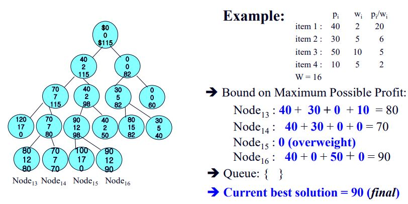
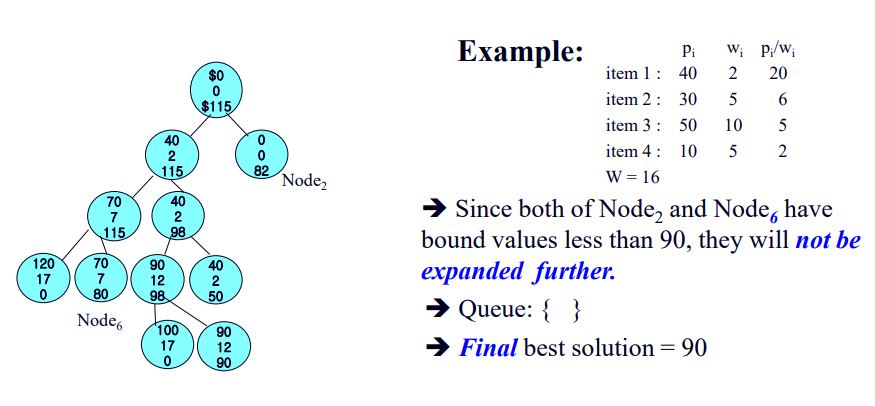
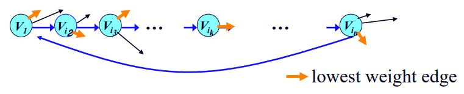
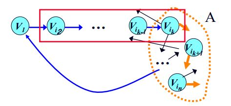

## Branch and Bound

백트래킹과 비슷한점: state-space tree가 문제 해결에 사용된다.
백트래킹과 다른점: tree를 탐색하는 방법이 정해져 있지 않다. 최적화문제에만 사용한다.

- 해결방법
  - step 1: node의 promising여부를 판단하기 위한 bound를 계산한다.
    - promising: 지금보다 더 좋은 값이 존재할 가능성이 있는 경우
  - step 2: non-promising하다면 다음 node를 탐색한다.

## Example 1

### The 0-1 Knapsack Problem (Breadth-First Search)

- state-space tree의 각 노드에는 세가지 값이 들어가 있다.

  - 현재 node의 총 이득
  - 현재 node의 총 무게
  - bound값: fractional knapsack문제로 취급했을 때 현재 node에서 취할 수 있는 최대 이득.

- 현재 모든 node에서 가장 큰 이득을 갖는 node의 이득값을 best solution으로 지정한다.

- 그리고 다음 탐색 node는 현재 node에서 다음 아이템을 추가할지 하지 않을 지 결정한다.

- 탐색한 node의 promising여부를 판단하고 계속해서 작업을 진행한다.
  - promising
    1. 현재 탐색중인 node의 bound가 best solution보다 커야한다.
    2. 현재 탐색중인 node의 무게가 제한무게보다 작아야한다.
- promising하다면 node를 queue에 담고 queue가 빌때 까지 계속 탐색한다.
  

```
p[] => profit array
bound() => compute bound of current node

public class node{
  int level; // bound
  int profit;
  int weight;
}

public static int knapsack2(int n, int[] p, int[] w, int W){
  queue_of_node Q; node u, v; int maxProfit;

  initialize(Q); // Q: empty
  v.level = 0; v.profit = 0; v.weight = 0;
  maxProfit = 0;
  enqueue(Q, V);
  while(!empty(Q)){
    dequeue(Q, v);
    u.level = v.level + 1;

    //take care of left child
    u.weight = v.weight + p[u.level];
    if(u.weight <= W && u.profit > maxProfit)
      maxProfit = u.profit;
    if(bound(u) > maxProfit)
      enqueue(Q, u);

    //take care of right child
    u.weight = v.weight;
    u.profit = v.profit;
    if(bound(u) > maxProfit)
      enqueue(Q, u);
  }
  return maxProfit;
}
```

## Example 2

### The 0-1 Knapsack Problem (Best-First Search)

- bound값을 promising을 판별한다음 확장할 다음 node를 선택하는데 활용한다.
- 우선순위가 node의 bound값에 의해 결정되는 우선순위 큐를 사용한다.(큰 값이 높은 우선순위)
- 예제 1과 비슷하게 흘러가지만 node를 확장할 때 우선순위에 따라서 확장한다.
- 먼저 현재 node의 child node를 두개 생성하고 현재 best solution과 child bound값을 비교하여 child bound값이 큰 node를 우선순위 큐에 삽입한다.
- 큐에서 node를 하나씩 꺼내면서 반복한다.
  

```
bound 함수는 위 예제와 동일함.

public class node{
  int level;
  int profit;
  int weight;
  float bound;
}

public static int knapsack3(int n, int[] p, int[] w, int W){
  priority_queue_of_node PQ; node u,v;
  int maxProfit;

  v.level = 0; v.profit = 0;
  v.weight = 0; maxProfit = 0;
  v.bound = bound(v);
  enqueue(PQ, v);

  while(!Empty(PQ)){
    dequeue(PQ, v);
    if(v.bound > maxProfit){
      u.level = v.level + 1;

      //take care of the left child;
      u.weight = v.weight + w[u.level];
      u.profit = v.profit + p[u.level];

      if(u.weight <= W && u.profit > maxProfit)
        maxProfit = u.profit;

      u.bound = bound(u);
      if(u.bound > maxProfit)
        enqueue(PQ, u);

      //take care of right child
      u.weight = v.weight;
      u.bound = bound(u);
      u.profit = v.profit;
      if(u.bound > maxProfit)
        enqueue(PQ, u);
    }
  }
}
```

## Example 3

### The Traveling SalesPerson Problem

- 시작 지점에서 모든 node를 방문하여 다시 돌아오는 경로중의 최소 경로를 구하는 알고리즘.
- state space tree의 node는 방문경로 [i<sub>1</sub>, i<sub>2</sub>, ... i<sub>k</sub>]와 bound를 저장한다.
- bound는 최소경로를 구하는 문제이기 때문에 현재 node에서 계속해서 확장할 경우 가질 수 있는 최소경로를 구한다.
- bound계산방법
  - root node bound: 각 node마다 나가는 edge중 가장 작은 값을 모두 더함.
    
  - 이미 [i<sub>1</sub>, i<sub>2</sub>, ... i<sub>k</sub>]를 지난 node: root node와 마찬가지로 나가는 최소 가중치를 더해 최소경로를 구하는데 제외해야 할 경로가 있다.
    1. 이미 지나온 경로
    2. 지나지 않은 vertax의 가장 짧은 나가는 경로가 이미 지나온 vertax로 향하는 경로
    3. 마지막으로 방문한 node가 시작 node로 향하는 경로
       
- Best-First Search로 탐색한다.
  - 우선순위 queue 이용
  1. root lower bound를 계산
  2. 자식 node들의 lower bound 계산
  3. 자식 node의 bound가 best solution보다 작다면 queue에 추가.
  4. queue에서 가장 낮은 bound의 node를 탐색하고 promising(bound < best solution)을 확인하기.
  5. 마지막 node에 다다르면 bound가 아닌 실제 방문경로 구하기, queue에 삽입하지 않는다. best solution과 비교해 더 작으면 update해준다.
  6. 2~5를 queue가 빌 때 까지 반복한다.

```
public static number travel2(int n, number[] W, node optTour){
  priority_queue_of_node PQ; node u, v;
  number minLength;

  initialize(PQ);
  v.level = 0; v.path = [1]; minLength = infinite;

  v.bound = bound(v);
  enqueue(PQ, v);
  while(!Empty(PQ)){
    dequeue(PQ, v);
    if(v.bound < minLength) // v is promising
      //take care of children
      u.level = v.level +1;
      for (all i such that 2≤ i ≤ n && i not in v.path) { // 탐색할 node선별
            u.path = v.path ; put i at the end of u.path;
            if ( u.level == n-2 ) {
                put index of only vertex not in u.path at the end of u.path;
                put 1 at the end of u.path;
                if (length(u) < minLength) {
                    minLength = length(u); optTour = u.path;
                }
            }
            else {
                u.bound = bound(u);
                if (u.bound < minLength )
                    enqueue(PQ,u);
            }
  }
  return minLength;
}

```
