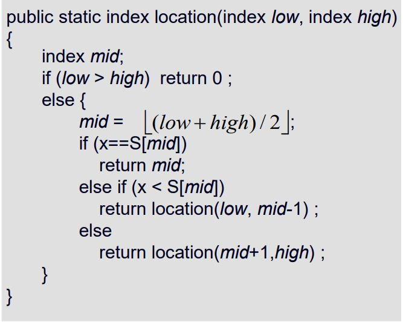
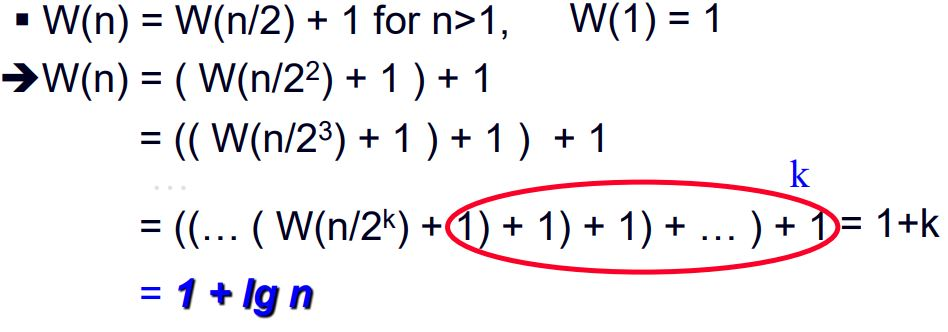
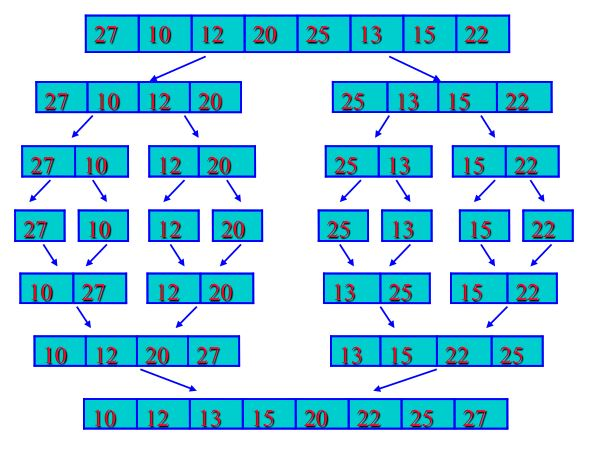
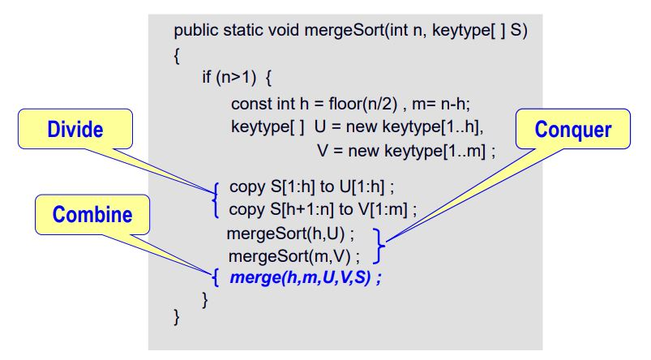
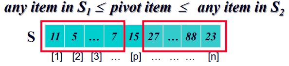
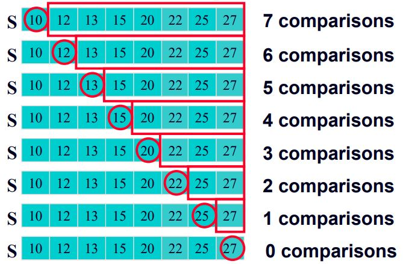

# Dvide and Conquer(분할 정복)

문제의 인스턴스에 대한 전체적인 해를 한번에 구하기 어려운 경우 인스턴스를 나누어서 나뉜 인스턴스에 대한 해를 구하는 알고리즘.

- Step 1: Divide

  - 인스턴스를 작게 쪼갠다.

- Step 2: Conquer
  - 쪼갠 인스턴스의 해를 구할 수 있다면 구하고, 그게 아니라면 재귀적인 방법으로 더 작게 쪼갠다.
- Step 3: (If necessary) Combine
  - 작은 인스턴스의 해를 결합하여 큰 문제의 해를 구한다.

## Dvide and Conquer Example

1. Binary Search

   - Step 0: If x = S[mid], quit

   - Step 1: Divide

     - 대략 반으로 나뉜 배열을 두개 만든다.
     - If x > S[mid] => 오른쪽 영역 탐색
     - If x < S[mid] => 왼쪽 영역 탐색

   - Step 2: Conquer
     - 검색한 값을 찾을 때 까지 재귀적으로 Divide를 반복.

   
   --Java code--

- 시간복잡도 분석

  - Basic Operation: x와 S[mid]의 비교연산
  - Input Size: n, 배열의 요소개수
  - n = 2<sup>k</sup> 라고 가정하자

    
    Binary Search의 최악의 경우는 `1 + lg n`이다.

2. Merge Sort
   

   - Step 1: Divide
     - 배열을 반분해서 두 개의 배열로 만든다.
   - Step 2: Conquer
     - 나뉜 배열의 크기가 작다면 바로 정렬하고, 그렇지 않다면 재귀적으로 다시 한번 각각의 배열을 반분한다.
   - Step 3: Combine
     - 나뉜 배열을 결합한다.

   
   ```java
   //Postcondition: U와 V의 값들을 비교해 S에 정렬함
   public static void merge(int h, int m, keytype[] U, 
                            keytype[] V, keytype[] S)
    {
      int i=1,j=1,k=1;

      // 정렬
      while(i<=h && j<=m){
        if(U[i] < V[i]){
          S[k] = U[i]; i++;
        }else{
          S[k] = V[j]; j++;
        }
        k++;
      }

      if(i > h){
        // copy V[j:m] to S[k:h+m]
      }
      else{
        // copy U[i:m] to S[k:h+m]
      }
    }
   ```
   --Java code--

- 시간 복잡도 분석

  Basic Operation: U[i], V[j]의 비교 연산<br>
  Input Size: h,m(U, V의 크기)

- Best Case 시간 복잡도(Merge함수)
  - 한 쪽의 배열 모든 값이 다른 배열의 최솟값보다 작은 경우
  - 복잡도: min(h,m)
- Worst Case 시간 복잡도(Merge함수)
  - 마지막을 제외하고 양쪽의 배열요소 모두 비교하는 경우
  - 복잡도: h + m - 1
- Worst Case 시간 복잡도(Merge Sort)
  - 반으로 나눈 배열들을 정렬할 때와 merge함수에서 모두 최악의 경우로 발생하는 경우.
  - W(n)=W(h)+W(m)+ W(h, m)<br>
    = W(h)+W(m)+h+m-1<br>

3. Quick Sort

- MergeSort와 비슷한점: 하나의 배열을 두개로 나누어서 각각 재귀적으로 정렬한다.

- MergeSort와 다른점: 배열을 세 부분으로 나눈다. (배열1, pivot item, 배열2)
  pivot item을 기준으로 왼쪽 배열에서는 pivot item보다 작은 값, 오른쪽 배열에는 큰 값을 위치시키고 정렬 후 결합한다.
  
- QuickSort Algorithm

  - input: low, high (subarray의 index중 가장 작은 값과 큰 값)
  - output: 정렬된 배열

  ```java
  public static void quickSort(index low, index high){
    index pivotPoint;

    if(high > low){
      pivotPoint = partition(low, high); // 분할 지점 구하기
      quickSort(low, pivotPoint - 1);
      quickSort(pivotPoint + 1, high);
    }
  }
  ```

- Partition Algorithm

  - pivot item의 위치를 반환한다.
  - 정렬할 배열내의 요소들을 하나씩 비교하며 위치를 변경해 partition을 수행한다.

  ```java
  public static index partition(index low, index high){
    index i, j, pivotPoint;
    keyType pivotItem = S[low];
    j = low;

    for(i = low + 1; i <= high; i++){
      if(S[i] < pivotItem){
        swap S[i], S[++j];
      }
    }

  pivotPoint = j;
  swap S[low], S[pivotPoint];
  return pivotPoint;
  }
  ```

- Partition Time Complexity
  - 기본 연산: S[i]와 pivotItem의 비교연산
  - Input Size: m = high - low + 1, subarray의 요소 개수
  - T(m) = m - 1
- Worst Case Time Complexity QuickSort
  - 기본 연산: partition에서 S[i]와 pivotItem의 비교연산
  - Input Size: n, 배열의 크기
  - QuickSort의 최악의 경우는 이미 정렬된 배열을 정렬하는 것이다.
    
  - n의 배열일 경우 시간 복잡도: T(n) = n - 1 + T(0) + T(n - 1)
    - n - 1: partition time
    - T(0): 왼쪽 배열 정렬 시간(= 0)
    - T(n - 1): 오른쪽 배열 정렬 시간
  - T(n) = n(n - 1) / 2
