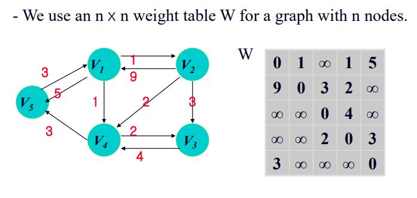

# Dynamic Programming

- Divide and Conquer(분할 정복)과 비슷한점
  - 한 문제의 인스턴스를 더 작은 인스턴스로 나눈다.
- Divide and Conquer(분할 정복)과 다른점

  - 작은 인스턴스들을 먼저 해결하고, 그 해를 이후 다시 사용한다. (배열을 이용한 반복문 사용)
  - Dynamic Programming은 Bottom-Up, Divide and Conquer는 Top Down

- Dynamic Programming 풀이 법
  - Step 1: 큰 문제에 대해 문제를 해결하기위한 재귀식을 구한다.
  - Step 2: bottom-up방식으로 작은 인스턴스를 해결한 뒤 작은 문제의 해를 이용해 큰 문제의 해를 구한다.

# Dynamic Programming Example

## 1. The Binomial Coefficient(이항 정리)

- n개의 원소에서 k개를 선택하는 경우의 수<br>
  C(n, k) = $\frac{n!}{k!(n-k)!}$ 이를 재귀식으로 나타내면<br>

  - C(n, k) = C(n - 1, k) + C(n, k - 1) (0 < k < n)
  - C(n, k) = 1 (k = 0 or k = n)

- 이항 정리를 Dynamic Programming으로 표현하기
  - 문제의 해를 담을 배열을 정한다. B[i][j]
  - 앞서 만든 재귀식을 배열에 적용한다.<br>
    B[i][j] = B[i-1][j-1]+B[i-1][j] 0<j<i <br>
    B[i][j] = 1 j=0 or i=j
  - 설계한 재귀식을 바탕으로 알고리즘을 구현한다.
  ```
  public static int bin2(int n, int k){
    index i, j;
    int[][] B = new int[0..n][0..k];
    for(i = 0; i <= n; i++){
      for(j = 0; j <= min(i,k); j++)
        if(j == 0 || j == i)
          B[i][j] = 1;
        else
          B[i][j] = B[i-1][j-1]+B[i-1]
    }
    return B[n][k];
  }
  ```
  - Time Complexity
    - 기본 연산: B[i][j] 업데이트
    - Input Size: n, k
    - i가 0부터 시작해 i <= K 일때 까지는 i만큼 반복, i > k이후에는 모두 k+1만큼 기본연산이 반복된다. 따라서 총 반복회수는<br>
    ```
    1+2+3+ ... + k + (k+1) ...
    + (k+1)
    = K(k+1)/2 + (k+1)(n-k+1)
    = (2n-k+2)(k+1)/2
    ```
    - n, k에 의해서 시간복잡도가 결정되므로 이항 정리 알고리즘의 시간복잡도는 Θ(nk)

## 2. Floyd’s Algorithm for Shortest Paths

- 그래프의 각 vertex에서 모든 vertex를 지나는 최소 경로를 찾는 알고리즘.
- 모든 vertex를 하나씩 따져가며 최단경로를 찾게되면 상당히 비효율적이다.
- 간선의 가중치를 이차원배열로 나타내는 테이블을 사용해 알고리즘을 구현한다.
  
  D<sup>(k)</sup>[i][j]는 {v<sub>1</sub>, v<sub>2</sub>, …, v<sub>k</sub>}를 지나는 v<sub>i</sub>부터 v<sub>j</sub>까지의 최소경로를 저장하는 배열이다.<br>
  EX) D<sup>(2)</sup>[2][5]는 {v<sub>1</sub>, v<sub>2</sub>}를 지나는 v<sub>2</sub>에서 v<sub>5</sub>까지의 최단 경로 = 14
- 재귀식 구하기

  - 최단경로를 구할 때 고려해야 하는 두 가지 경우가 있다.

  1. 최단경로가 집합 {v<sub>1</sub>, v<sub>2</sub>, …, v<sub>k</sub>}에서 v<sub>k</sub>를 지나지 않는 경우(D<sup>(k)</sup>[i][j])에는 결국 최단경로가 D<sup>(k-1)</sup>[i][j]과 같게 된다. 따라서 위와같은 경우는<br>
     D<sup>(k)</sup>[i][j] = D<sup>(k-1)</sup>[i][j]
  2. 최단경로가 집합 {v<sub>1</sub>, v<sub>2</sub>, …, v<sub>k</sub>}에서 v<sub>k</sub>를 지나는 경우에는 v<sub>i</sub>~v<sub>k</sub>의 최단경로와 v<sub>k</sub>~v<sub>j</sub>의 최단 경로를 더한 값이된다.<br>
     D<sup>(k)</sup>[i][j] = D<sup>(k-1)</sup>[i][k] + D<sup>(k-1)</sup>[k][j]
  3. 최종적으로 구하고자 하는 최단 경로는 두 가지 경우중에서 더 작은 값을 최단경로로 선택한다. 따라서 최종적인 재귀식은<br>
     D<sup>(k)</sup>[i][k] = min(D<sup>(k-1)</sup>[i][j], D<sup>(k-1)</sup>[i][k] + D<sup>(k-1)</sup>[k][j])

  ```
  public static void floyd(int n, number[ ][ ] W, number[ ][ ] D){
    index i, j, k;
    D = W;
    for(k=1; k <= n ;k++)
      for (i=1; i <= n ; i++)
        for (j=1; j <= n ; j++)
           D[i][j]=min(D[i][j], D[i][k]+D[k][j]);
  }
  ```

  시간 복잡도는 n<sup>3</sup>임을 알 수 있다.

## Dynamic Programming and Optimization Problem

- Dynamic Programming을 사용하기 위한 조건은 Principle of Optimality을 만족해야 한다.
  - Principle of Optimality: 전체문제의 최적의 해가 부분문제들의 최적의 해로부터 만들어져야 한다.
