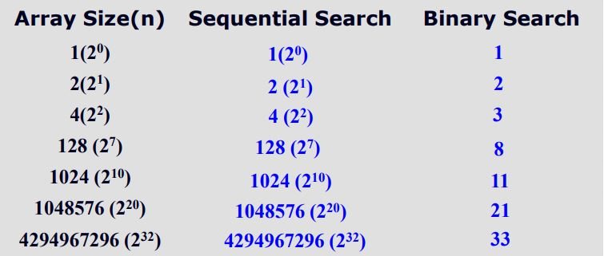

# Algorithm

- 알고리즘 : 각 문제 인스턴스에 대한 솔루션을 생성하기 위한 단계별 절차
- 문제 인스턴스 : 각 매개변수에 특정 값이 할당되는 문제
  - ex) x + y = ? -> 2 + 3 = ?

# 효율적 알고리즘 개발의 중요성

- 개발을 진행 할 때 알고리즘을 얼마나 효율적으로 만드는가에 따라 어플리케이션 기능의 차이가 확연히 드러난다.

- 예시1 ) Sequential Search vs. Binary Search

  

  - 검색 알고리즘 최악의 경우를 비교 횟수로 나타낸 것이다.
  - 선형 검색과 이진 검색은 배열의 크기가 작을 때는 크게 차이가 나질 않는다.
    그러나 배열의 크기가 커지면 커질 수록 차이가 확연하게 드러난다. 만약 방대한 양의 데이터를 관리하면서 선형 검색 알고리즘을 사용하면 어플리케이션의 검색 속도가 아주 느릴것이다.

- 예시2 ) Recursive vs. Iterative Fibonacci Algorithm

  

  - 피보나치 수열을 반복문으로 구현했을 때, 재귀 함수로 구현했을 때 수행 시간을 비교한 것이다.
  - 검색 알고리즘과 마찬가지로 피보나치 수열의 길이가 길어질수록 수행시간의 차이가 극명하게 난다.
  - 재귀 함수는 이미 계산된 하위 항의 모든 계산 과정을 재귀함수로 호출해야 하지만 반복문은 이미 계산된 결과를 사용하기 때문에 수행 시간을 크게 단축 할 수 있다.

# 알고리즘 분석

- 우리가 알고리즘의 효율성을 분석할 때 흔히 `Complexity`(복잡도)라는 말을 사용한다.
- 복잡도를 구할 때 함수를 사용하는데, 함수에 전달되는 매개변수는 `Input Size`와 `Basic Operation`이다.

1.  Input Size
    - 입력의 크기를 나타내는 척도
    - 배열의 크기, 숫자 하나, 그래프에서 노드의 개수와 간선의 개수 등
2.  Basic Operation
    - 알고리즘에서의 개별 연산, 혹은 연산들의 묶음이 알고리즘에서 실행되는 횟수
    - 검색 알고리즘에서는 비교 연산이 Basic Operation이다.
3.  Time Complexity Analysis
    - 각각의 Input Size에서 얼마나 많은 Basic Operation이 수행되는지 분석하는 것.
    - 예를 들어 선형 검색 알고리즘을 n의 크기 배열에서 수행 했을 때 최악의 경우 몇번의 비교연산이 필요한가를 구하는 것이다.

- Types of Time Complexity Analysis

  - Every Case Analysis : 기본 연산이 크기 n의 모든 인스턴스에 대해 동일한 횟수만큼 수행되는 경우
  - Non-Every Case Analysis
    1. Best Case Analysis : 연산 최소 횟수인 경우
    2. Worst Case Analysis : 연산 최대 횟수인 경우
    3. Average Case Analysis : 연산 횟수 평균인 경우

- 알고리즘의 분석 기법을 사용해 개발 할 때 효율적인 알고리즘을 선별할 수 있다.
