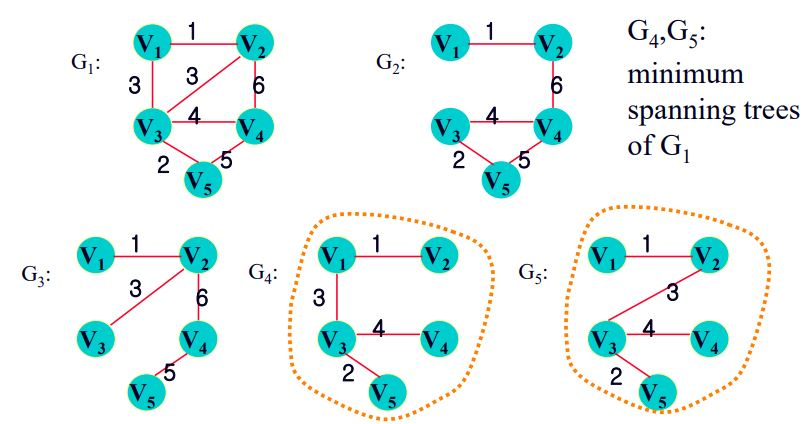

# The Greedy Approach

- Greedy Algorithm: 어떤 문제 인스턴스의 해가 일련의 선택으로 이루어질 때 최선의 선택을 하면서 최종해를 구하는 알고리즘. 하지만 매 선택마다 최선의 선택을 한다고 해서 반드시 최적의 해를 보장하는 것은 아니다.
- General Greedy Approach
  1. 현재 선택할 수 있는 가장 최선의 해를 선택한다.
  2. 선택한 값이 최적의 해인지 확인한다.
  3. 실제 전체문제의 최적의 해가 되는지 확인한다.

## Example

- Minimum Spanning Trees

  - Spanning Tree: 원래 그래프에서 Tree형태로 변형한 subgraph
  - Minimum Spanning Trees: 최소의 가중치를 갖는 Spanning Tree
    
    G4, G5는 G1의 Minimum Spanning Trees다.

  1. Prim’s Algorithm
     - Y: Minimum Spanning Trees에 포함된 vertax
     - W[i][j] : Weight table
     - nearest[i]: Y에서 Vi에 가장 가까운 vertex의 index.
     - distance[i]: Vi와 nearest[i]에 저장된 vertex의 가중치
