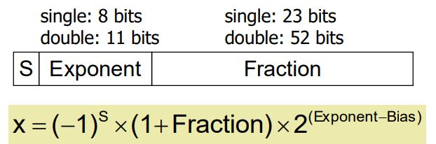

# Arithmetic for Computers

## Integer Addition

- Overflow
  - 양수 + 음수 -> overflow 발생하지 않음
  - 양수 + 양수(sing bit = 1), 음수 + 음수(sing bit = 0) ->
    overflow 발생

## Integer Subtraction

- 음수를 더하는 연산.
  
- Overflow
  - 음수 - 음수, 양수 - 양수 -> overflow발생하지 않음
  - 음수 - 양수(sing bit = 0), 양수 - 음수(sing bit = 1) -> overflow 발생

## Dealing with Overflow

- ignore overflow
- raising an exception

## Multiplication

- MIPS Multiplication
  - mul rd, rs, rt

## Division

- 0으로 나누는지 체크한다.

- MIPS Division
  - div rs, rt

## Floating Point

- Two representations
  - Single precision(32-bit, float)
  - double precision(64-bit, double)
- Floating-Point Format
  
  - S: sign bit(0 => 양수, 1 => 음수)
  - Exponent
    - Single: Bias = 127; Double: Bias = 1203
  - Fraction: 소수부분을 나타내는 bit

## FP Instructions in MIPS

- FP registers: $f0, $f1, ... $f31 32개의 레지스터
- Single-precision arithmetic
  - add.s, sub.s mul.s, div.s
- double-precision arithmetic
  - add.d, sub.d mul.d, div.d
