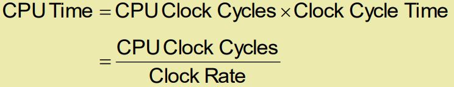
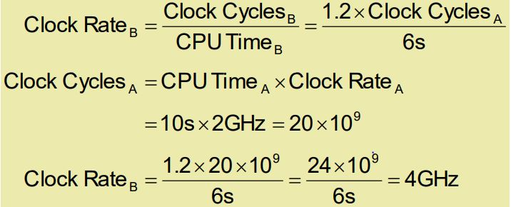
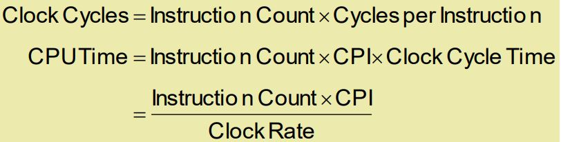
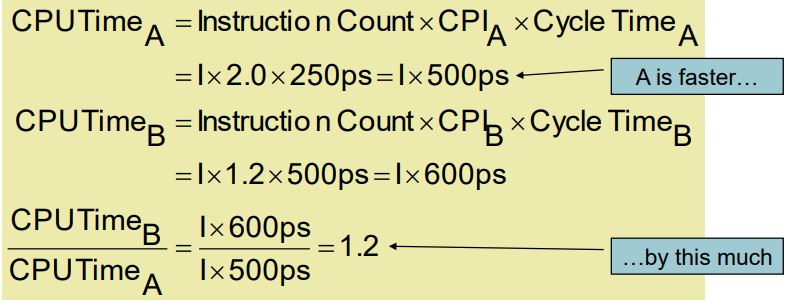
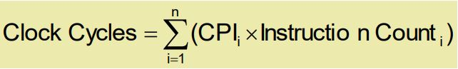
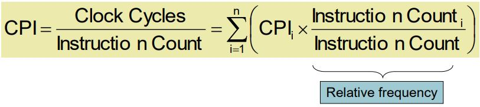
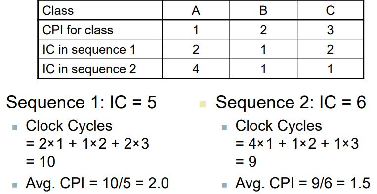

## Classes of Computers

- Personal computers(PC)
- Server computers
- Supercomputers
- Embedded computers

## Understanding Performance

- Algorithm
  - 실행된 작업 수를 결정
- Programming language, compiler, architecture
  - 연산당 실행되는 기계 명령의 수를 결정
- Processor and memory system
  - 명령 실행 속도 결정
- I/O system (including OS)
  - 입출력 작업 실행 속도 결정

## 컴퓨터의 성능을 향상시키는 7가지 아이디어

1. 추상화를 사용하여 설계 단순화
2. 일반적인 케이스를 빠르게 만듦(빠른 속도의 연산)
3. 병렬화(동시 작업)을 통한 성능
4. 파이프라이닝을 통한 성능
5. 예측을 통한 성능
6. 메모리 계층화
7. 중복성을 이용한 신뢰성

## 계층구조

- Application software : high-level language로 쓰여진 소프트웨어
- System software
  - Compiler: high-level language를 machine code로 번역함.
  - Operating System
    - 입출력 관리
    - 메모리, 저장소 관리
    - 프로세스 스케쥴링, 자원 공유
- Hardware

## Levels of Program Code

- High-level language
- Assembly language
  - 명령어의 텍스트 표시
- Hardware representation
  - 이진 정수로 이루어짐

## Components of a Computer

- 모든 종류의 컴퓨터에는 공통된 컴포넌트가 있다.
  - Desktop, server, embedded
- Input/output includes
  - User-interface devices
    - 디스플레이, 키보드, 마우스
  - Storage devices
    - 하드 디스크, CD, flash
  - NetWork adapters

## Inside the Processor (CPU)

- Datapath: 데이터 연산을 실행
- Control: datapath, memry등
- Cache memory: 데이터에 즉시 액세스할 수 있는 작고 빠른 SRAM메모리

## Abstractions

- 추상화는 복잡도를 다룰 때 도움을 준다.
- Instruction set architecture(ISA)
- Application binary interface
  - ISA에 시스템소프트웨어 인터페이스가 더해진 애플리케이션
- Implementation

## Response Time and Throughput(처리량)

- Response time: 작업을 수행하는 데 걸리는 시간
- Throughput: 단위시간당 작업합계

- Relative Performance
  - 1/실행시간
  - Example: 실행 시간 비교
    - 10s A, 15s B
    - B의 실행시간 / A의 실행시간 = 1.5
    - B는 A보다 1.5배 더 빠르다.

## Measuring Execution Time(실행시간 측정)

- Elapsed time(경과 시간)
  - 모든 측면을 포함한 응답시간
    - 프롯싱, 입출력, OS overhead, idle time
    - 시스템 성능을 나타낸다.
- CPU time
  - 지정된 작업을 처리하는 데 소요된 시간
  - User CPU time, System CPU time으로 구성된다.
  - 프로그램에 따라 CPU와 시스템의 성능에게 의해 다른 영향을 받는다.

## CPU Clocking

- 고정 속도 Clock에 의해 제어되는 디지털 하드웨어의 작동
- Clock period: Clock cycle의 지속 시간
- Clock frequency: 사이클/초

## CPU Time

- 성능을 향상시키려면

  - Clock cycle 수 감소
  - Clock rate 증가
  - 하드웨어 설계자는 대부분의 경우 Clock rate를 cycle 카운트와 교환해야 한다.

- Example
  - Computer A: 2GHz clock, 10s CPU time
  - Designing Computer B
    - CPU time 6s
    - A보다 더 많은 Clock cycle x 1.2 발생
  - B의 Clock은 얼마나 빨라야 하는가?
    

## Instruction Count and CPI

- CPI Example

  - Computer A: Cycle Time = 250px, CPI = 2.0
  - Computer B: Cycle Time = 500px, CPI = 1.2
  - Same ISA
    

  - instruction 클래스에 따라 cycle의 수가 다른경우
    
  - 가중 평균 CPI(Weighted average CPI)
    

  - Example
    
