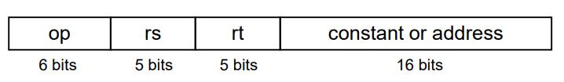

## Register vs. Memory

- 레지스터는 메모리보다 액세스 속도가 빠르다.
- 메모리 데이터를 조작하려면 로드 및 저장이 필요하다.
  - 추가 명령이 실행된다.
- 컴파일러는 가능한 한 변수에 레지스터를 사용해야 한다.
  - 변수의 사용빈도가 낮은 경우에만 메모리로 보낸다.
  - 레지스터 최적화는 중요하다!

## Immediate Operands

- Instruction에 지정된 상수데이터를 연산한다. 
  `addi $s3, $s3, 4`
- Immediate Operands에서 뺄셈은 지원하지 않는다. 음수인 상수를 더해줘야 한다. 
  `addi $s2, $s1, -1`

- 작은 상수를 사용하는게 일반적이며, Immediate Operands연산자는 load명령을 회피한다.

## The Constant Zero

- MIPS 레지스터에는 0을 저장하고 있는 레지스터가 존재한다. (값을 덮어 쓸 수 없다.)
- 레지스터의 데이터를 이동시킬 때 사용된다. 
  `add $t2, $s1, $zero` s1레지스터의 데이터를 t2로 이동(t2 = s1 + 0)

## Binary Integers

- Unsigned (n bit)
  - Range: 0 ~ +2n – 1
  - 첫 비트가 0인 이진 정수
  - ex) 0000 10112
- 2s-Complement Signed (n bit)
  - Range: –2n–1 ~ 2n–1 – 1
  - 첫 비트가 1인 이진 정수
  - ex) 1111 11002
- 음수가 아닌 수를 표현할 때에는 두 표현의 형태가 같다.
- 2의 보수를 취하려면 원래 이진 정수의 부정을 취한뒤 1을 더하면 된다. 
  `~x + 1 = -x`

## Sign Extension

- 32bit크기의 레지스터를 사용하여 숫자를 표현하면 CPU는 모든 비트를 고려해서 수를 표현하기 때문에 bit의 수가 32bit보다 작은 데이터가 레지스터에 저장되면 데이터 앞쪽 bit들은 데이터 가장 앞 bit로 모두 채워준다.
- Examples: 8-bit to 16-bit
  - +2: 0000 0010 => <u>0000 0000</u> 0000 0010
  - –2: 1111 1110 => <u>1111 1111</u> 1111 1110

## Representing Instructions

- 명령어는 이진수(기계어)로 인코딩 된다.
- MIPS 명령어

  - 32-bit 명령어로 인코딩됨
  - operation code, 레지스터 번호 등을 인코딩하는 형식

- Register numbers
  - $t0 – $t7 : 8 – 15
  - $t8 – $t9 : 24 – 25
  - $s0 – $s7 : 16 – 23

## MIPS R-format Instructions

- Instruction fields

  - op: operation code (opcode)
  - rs: 첫 번째 소스 레지스터 번호
  - rt: 두 번째 소스 레지스터 번호
  - rd: 목적 레지스터 번호
  - shamt: 시프트 량 (00000 for now)
  - funct: function code (extends opcode)

- Example
  

## MIPS I-format Instructions

- Immediate 산술, 로드(lw), 스토어(sw) 명령어에 사용된다.

  - rt: 목적, 소스 레지스터 번호
  - Constant: –215 to +215 – 1
  - Address: 기본 주소에서 추가된 rs 오프셋(lw, sw명령)

- Example
  

## Logical Operations

- Shift Operations
  - shamt: 얼마나 많이 위치가 이동되었는가?
  - Shift left logical(sll)
    - 왼쪽으로 이동하고 0bit로 채운다.
    - sll i bit 마다 2i배 증가한다.
  - Shift right logical(srl)
    - 오른쪽으로 이동하고 0bit로 채운다.
    - srl i bit마다 2i배 감소한다.
- AND Operations
  - 비트를 마스킹하는 데 유용하다.
    - 일부 비트를 선택하고 다른 비트를 0으로 만드는 작업.
      
- OR Operations
  - 비트를 포함할 때 유용하다.
    - 일부 비트를 1로 설정하고 나머지 비트는 변경하지 않음.
      
- NOT Operations
  - 비트를 반전시키는 데 유용하다.
    - 0을 1, 1을 0으로 변경
  - MIPS에는 NOR로 NOT을 구현할 수 있다.
    

## Conditional Operations

- `beq rs, rt, L1`
  - if (rs == rt) L1 라벨이 붙은 명령에 따라 분기한다.
- `bne rs, rt, L1`
  - if (rs != rt) L1 라벨이 붙은 명령에 따라 분기한다.
- `j L1`

  - L1 라벨이 붙은 명령으로 무조건 건너뛴다.

- Compiling If Statements
  
- Compiling Loop Statements
  
- `slt rd, rs, rt`
  - if (rs < rt) rd = 1; else rd = 0;
- `slti rt, rs, constant`
  - if (rs < constant) rt = 1; else rt = 0;
- beq, bne과 결합하여 사용할 수 있다. 
  slt $t0, $s1, $s2 # if ($s1 < $s2) 
  bne $t0, $zero, L # branch to L

- 왜 blt, bge와 같은 이상, 이하 연산자가 없는가?
  - 하드웨어는 <, ≥ 등의 연산자가 =, ≠연산자보다 느리다.

## Basic Blocks

- 명령어들의 나열
  - 마지막 부분을 제외하고 중간에 branch를 작성할 수 없다.
  - 첫 부분을 제외하고 중간에 branch target을 작성할 수 없다.

## Procedure Calling Step

1. 매개변수를 레지스터에 저장
2. 함수로 제어 전환
3. 함수를 위한 저장소 획득
4. 함수 실행
5. 호출자 레지스터에 결과 저장
6. 호출 위치로 돌아감

## Register Usage

- $a0 – $a3: arguments (reg’s 4 – 7)
- $v0, $v1: result values (reg’s 2 and 3)
- $t0 – $t9: 임시변수
  - callee측이 덮어쓸 수 있다.
- $s0 – $s7: saved
  - callee가 저장/복원 해야함
- $gp: 정적 데이터 글로벌 포인터 (reg 28)
- $sp: stack pointer (reg 29)
- $fp: frame pointer (reg 30)
- $ra: return address (reg 31)

## Procedure Call Instructions

- `jal ProcedureLabel` : jump and link
  - $ra에 기재된 다음 지시사항의 주소로 점프함
- `jr $ra` : jump register
  - $ra를 프로그램 카운터레 복사
  - 계산된 점프에도 사용가능(switch문)

## Local Data on the Stack

## Memory Layout

- Text: 프로그램 코드
- Static data: 전역변수, 정적 변수
- Dynamic data: heap(동적 메모리)
- Stack: 자동 저장
  
