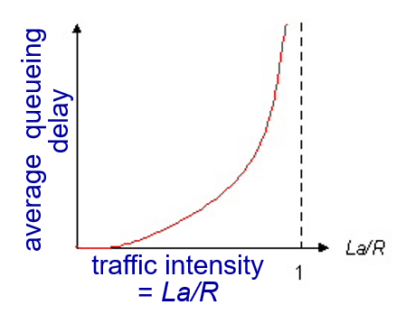

# 1. Internet 
## nuts and bolts의 관점
- host(end system)는 Network System을 실행 할 수있는 node
- communication links: host를 연결하는 연결망
- packet switches: (인터넷과 동일한 의미로 사용할 수 있다.)
- host들이 communication links로 서로 연결이 되고 연결된 host들은 packet switches망을 사용하여 데이터를 주고 받는다.
- Internet: network of networks

## service의 관점
- 응용프로그램에 제공하는 제공하는 인프라
    - ex) Wep, email, games ...
- API를 제공

## Protocol이란?

- protocol: 메시지를 보내고 받을 때 제어 매커니즘
    - ex) TCP, IP, HTTP, 802.11
    - 프로토콜 정의
        - Event, Action, Format(언제 어떤 Event가 발생하는지, 발생한 Event에 대해 취해야할 Action, 전달하는 데이터의 Format)

# 2. Network edge
## network 구조
- network edge: 사용자가 네트워크에 접속되는 지점(router)
- access network: communiction link(wire(802.3, Ethernet), wireless(WiFi))
- network core: 접속된 사용자가 다른 edge로 갈 때 지나는 지점(router)

## Host: 데이터 packet 전송
- Packet
    - network 계층의(OSI 3계층)전송의 기본단위
    - pakcet 교환망에서는 전송단위가 아닌 일반적인 개념으로 사용

# 3. Network Core
- packet-switching: 응용계층의 데이터를 packet단위로 나눠서 전송.

## packet-switching:store-and-forward
- store-and-forward: 다음 router로 데이터를 전송할 때 진행
    - 다음 router로 데이터를 전송하기 전 까지 데이터가 완전히 router에 들어와야 한다.
    - router에 잠시 저장한 뒤 다음 목적지를 특정하고 특정된 router로 데이터를 전송한다.
    - store하는 과정에서 delay,loss가 발생할 수 있다.
        - delay, loss: router에 할당된 메모리는 유한하기 때문에 많은 양의 데이터가 들어올 경우 발생
        - 이런 문제는 network를 공유하는 특성 때문에 완전히 제거할 수 없다.(최소화를 시켜야 함)

packet-switching|circuit-switching|
|------|-----|
|네트워크 자원 공유|네트워크 자원 독점|
|store and forward|direct|
|delay, loss 발생||
|더 많은 사용자가 동시에 사용가능||

- reliable data transfer(신뢰성있는 전송)
    - no loss, no delay, in order delivery
        - no loss, no delay: 발생 시 처리 알고리즘(혼잡제어)
        - in order delivery: 전송된 데이터 순서대로 받아지는 것 

# 4. Delay and loss

## Packet delay
- 라우터에 packet 도착율이 전송률보다 높다면 delay, loss가 발생할 수 있다.
- delay의 네가지 종류
    
    1. processing delay: 페킷이 라우터에 도착해 큐에 저장되는 시간
    2. queueing delay: 라우터에 페킷이 큐에 들어오고 나갈 때 까지 걸리는 시간
    3. propagation(전파) delay: 페킷이 다음 라우터로 이동하는 시간
    4. transmission(전송) delay: 전체 페킷이 라우터에서 빠져나가는 시간  
    - 네 가지의 delay중에서 processing delay, queueing delay 제어가능한
    delay다. 나머지 delay들은 하드웨어에 영향을 많이 받아 이미 결정된 delay값이다.
    
    - processing delay와 queueing delay는 queue의 구조(큐의 개수, 링크 리스트, 배열 ...)와 동작 방식(FIFO, 우선 순위 큐), 라우팅 알고리즘(좋은 라우팅 테이블)에 따라 성능이 달라진다.

## Queueing delay

R: link bandwidth (bps) 
L: packet length (bits) 
a: average packet arrival rate  

- x축 값이 증가함에 따라 y축(delay)값이 기하급수적으로 증가한다.
- 해당 그래프에 영향을 미치는 값들 중에 R, L은 하드웨어의 성능에 따라 정해지는 값이다. 따라서 delay의 값을 제한하려면 a값의 제어가 필요하다.
- 결론은 delay를 일정 수준보다 높지 않도록 유지하고 싶다면 paket의 평균 도착율이 일정크기 이상으로 커지지 않도록 네트워크를 설계해야한다.

# 5. Protocol layers, service model
- 왜 계층별로 나누었을까?
    - 각 계층별로 제공하는 서비스가 다르기 때문이다.
- OSI 7계층

    - 7계층 application layer
        - 네트워크 응용프로그램 지원
        - FTP, SMTP, HTTP
    - 6계층 presentation layer
    - 5계층 session layer
    - 4계층 transport layer
        - 프로세스-프로세스 데이터 전송
        - TCP, UDP
    - 3계층 network layer
        - 라우터(출발지)-라우터(목적지) 데이터 전송
        - IP, routing protocols(RIP, OSPF)
    - 2계층 data link layer
        - 이웃한 네트워크 요소간 데이터 전송
        - Ethernet(802.3), 802.11, PPP, HDLC
    - 1계층 physical layer

# 6. Network security
- 보안의 3원칙
    - <strong>C</strong>onfidentiality (기밀성)
    - <strong>I</strong>ntegrity (무결성)
    - <strong>A</strong>vailability (가용성)

- virus: 스스로 복제(능동, 혼자서 복제)하는 감염 
- worm: 스스로 복제(수동, 실행가능한 것을 받아야 복제)하는 감염
- Denial of Service(Dos): 서비스를 이용하지 못하게함
- packet sniffing: 전송중인 데이터 패킷을 훔쳐보는 것 