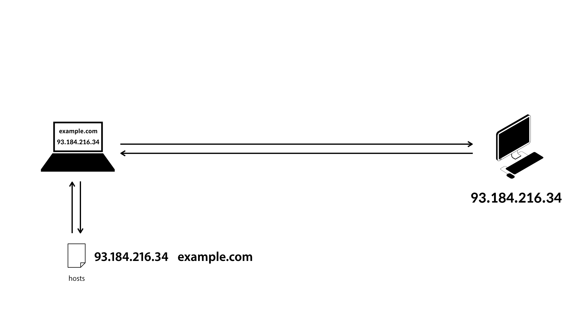
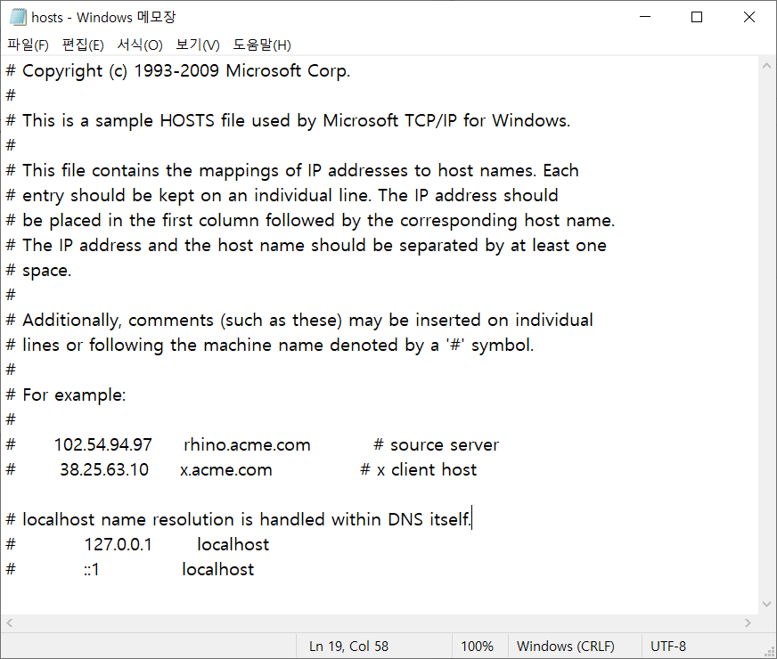
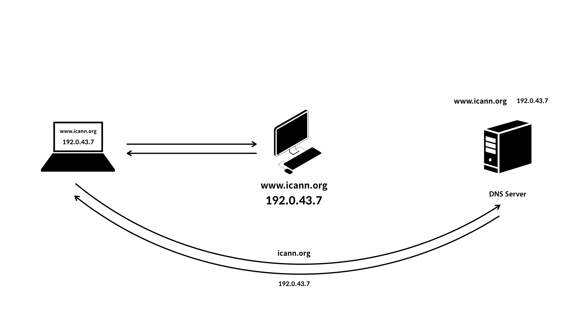

IP주소를 기억하기에는 쉽지 않은 일이다. 그렇기에 고안된 것이 **D**omain **N**ame **S**ystem 줄여서 **DNS**이다.

- Host: 인터넷에 연결된 각각의 컴퓨터, 디바이스
- 두 대의 컴퓨터가 서로 통신하기 위해서는 반드시 서로의 IP가 필요하다.
    

- 운영체제마다 hosts라는 파일이 존재함
    - {IP  Domain-Name}이 기록되어 있음
    - [OS] hosts file location
        - ex) UNIX : /etc/hosts (접근시 관리자 권한이 필요함)
        
    - 파일을 수정하면 도메인으로 해당 IP에 접속가능 하지만 hosts파일의 소유자만 접근 할 수 있는 DNS이전 방식이다.

# DNS의 원리
- server 컴퓨터는 DNS server에 자신의 IP와 Domain Name을 저장할 것을 요청한다.
- DNS server는 요청받은 내용을 저장한다.
- client가 Domain Name을 입력한다.
- 인터넷에 연결된 순간 DHCP를 이용해 Client에 DNS Server의 IP를 등록한다.
- Client의 hosts파일을 살펴보고, Domain이 없을 경우 DNS Server에 해당 Domain의 IP를 요청한다.
- DNS Server는 IP를 Client에 전달하고 Client는 전달받은 IP로 접속한다.
    

- DNS Server를 따로 사용하면 DNS Server에 변경사항이 있더라도 모든 컴퓨터는 그 변경사항을 곧바로 알 수 있다.

# Public DNS
- DNS의 동작원리는 이해했다. 그렇다면 DNS Server또한 서버이기 때문에 IP를 가지고 있을 것이다. DNS server의 IP는 어떻게 알까?
- 컴퓨터를 인터넷에 연결한 순간에 인터넷 서비스 프로바이더(통신사, KT, U+, sk ...)가 제공하는 특정 DNS server에 자동으로 연결해준다.
- public DNS server: 기업이 운영하는 DNS server, host가 사용하고 싶은 DNS server를 결정할 수 있다.
- 한국이 운영하는 DNS에서 막아놓은 도메인들이 있는건가?

# DNS의 구조
- DNS Server는 매우 많다. 이런일이 가능한 이유는?
`blog.example.com`
- 도메인 주소 뒤에는 '.'이 생략되어 있다.
    - '.'은 특별한 정보를 담고 있지 않아 생략될 뿐
    - 가장 마지막 '.': root Domain
    - com: Top-level Domain
    - example: Second-level Domain
    - blog: sub Domain

- 각각의 Domain을 전담하는 DNS Server들이 존재한다.
    - Root DNS server
    - Top-level DNS server
    - Second DNS server
    - Sub DNS server
- 상위 Domain을 관리하는 DNS Server는 하위의 DNS server에 저장된 데이터를 알고 있어야한다.
    - Root DNS server의 IP에 접근했을 때 Top-level DNS server의 IP를 알려준다.
    - Top-level server의 IP에 접근했을 때 Second DNS DNS server의 IP를 알려준다.
    - Second DNS server의 IP에 접근했을 때 sub DNS server의 IP를 알려준다.
    - sub DNS server의 IP에 접근했을 때 자신의 IP를 요청한 컴퓨터에 알려준다.
- 하위 DNS server는 상위 DNS server의 정보를 알고 있지 않아도 된다.
    