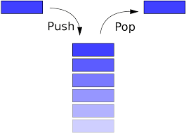
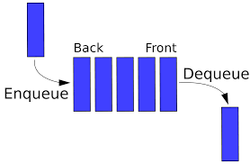
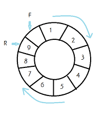

# Stack(스택)이란?

- Last In First Out/후입선출의 특성으로 데이터를 관리하는 자료구조

  

    
  

## 스택의 기능(함수)

- push(entry) : 스택에 entry(새로운 데이터)를 쌓는다.
- pop( ) : 가장 늦게 추가된 데이터, 즉 가장 위쪽에 위치한 데이터를 스택에서 꺼낸다.
- empty( ) : 스택이 비었는지 판별한다.
- size( ) : 스택의 크기를 반환한다.
- top( ) : 스택에서 다음으로 꺼낼 데이터(가장 위쪽 데이터)를 반환한다.
- 스택은 배열 또는 연결 리스트로 구현 가능하다.

## 스택은 어디에 사용되는가?

- 계산기 : 전달된 수식의 괄호를 검사하여, 연산 우선순위를 정하는데 사용된다.
- 웹 페이지 뒤로가기 : 현재까지 방문한 웹 페이지에 대한 데이터를 스택에 저장 후 사용자가 뒤로가기를 명령하면 이전 페이지로 돌아간다.
- 역순 문자열 : 문자열의 문자를 차례대로 스택에 저장 후 모두 다시 pop하면 역순 문자열을 구할 수 있다.

# Queue(큐)란?

- First In First OUt/선입선출의 특성으로 데이터를 관리하는 자료구조

    
  

## 큐의 기능(함수)

- enqueue(entry) : 큐에 entry(새로운 데이터)를 쌓는다.
- dequeue( ) : 가장 빨리 추가된 데이터를 큐에서 꺼낸다.
- empty( ) : 큐가 비었는지 판별한다.
- size( ) : 큐의 크기를 반환한다.
- front( ) : 큐에서 다음으로 꺼낼 데이터(가장 먼저 추가된 데이터)를 반환한다.
- 큐는 배열 또는 연결 리스트로 구현 가능하다.

## 큐의 종류

1. Linear Queue(선형 큐)
   - 기본적인 형태의 큐
   - 배열로 구현되어 있다면 큐에 데이터를 추가/삭제시 추가 연산이 발생할 수 있다.
2. Circular Queue (원형 큐)

   - 배열로 구현된 큐의 단점을 보완할 수 있는 큐의 형태
   - 만약 배열의 현재 index에서 dequeue를 수행한다면 다음으로 dequeue될 데이터의 index는 `(index+1) % 배열의 사이즈`이다. 
   다음 index를 위와 같이 구한다면 마지막 index에서 dequeue를 진행하더라도 배열의 처음 부분으로 돌아 올 수 있다.

      

        
      

3. Priority Queue(우선순위 큐)
   - 데이터의 삽입 순서와 상관 없이 큐에서 지정된 우선순위에 따라 데이터를 dequeue하는 큐의 형태다. (만약 우선순위가 정수의 크기가 가장 큰 정수라면 삽입 순서와 상관없이 가장 큰 정수부터 큐에서 dequeue가 일어난다.)
   - 이진 트리구조 중 하나인 Heap으로 구현된다.

## 큐는 어디에 사용되는가?

- 번호표 대기 : 번호표를 먼저 뽑는 순서대로 업무를 본다.
- 프린터 출력 : 가장 먼저 대기열에 오른 자료부터 인쇄된다.
- 그래프 탐색(BFS) : 그래프를 넓이 우선 탐색법으로 탐색할 때 사용된다.
- 우선순위 스케줄링 : 작업의 우선순위를 지정하여 우선순위에 맞게 프로세스를 실행을한다.
