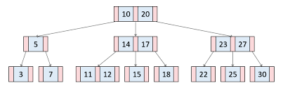

# 트리(Tree)구조란?

- 대표적인 비선형 자료구조.
- 데이터를 저장하고 있는 노드가 branch로 연결된 자료구조.
- 트리는 하나의 root노드를 시작으로 나무가 뒤집힌 모양과 비슷하다.

  

  
  </q>

## 트리의 종류

1. Binary Tree(이진 트리)

   - 각 node의 Child수가 최대 2개인 트리구조.
   - 이진트리에서도 Full Binary Tree와 Complete Binary Tree로 나뉨
     - Full Binary Tree
       - 모든 leaf node의 깊이가 같은 tree
       - leaf node가 아닌 node들은 모두 2개의 child를 갖는다.
         
     - Complete Binary Tree
       - 가장 깊은 깊이의 node들을 제외하고 왼쪽부터 꽉차있는 트리.
       - 만약 깊이가 k라면 최소 2^k만큼의 노드가 존재한다.  
         
     - Full Binary Tree는 Complete Binary Tree가 될 수 있지만 역은 성립하지 않을 수 있다.

2. Binary Search Tree(이진 탐색 트리)

   - 이진 트리에서 데이터의 검색을 효율적으로 하기위한 트리.
   - 예를 들어 루트 노드의 저장된 데이터보다 작거나 같은 데이터를 가진 노드 들은 왼쪽 서브트리, 큰 데이터를 가진 노드들은 오른쪽 서브트리에 배치하는 방식으로 데이터를 나누어 놓는다.
   - 데이터를 탐색하는데 있어 찾고 싶은 데이터와 현재 노드의 데이터 값을 비교하면서 노드를 이동하여 탐색하면 좀 더 효율적인 데이터 탐색이 가능하다.

     

3. Heap(힙)

   - 최댓값 및 최솟값을 찾아내는 연산을 빠르게 하기 위해 고안된 완전이진트리(complete binary tree)를 기본으로 한 트리
   - 종류는 Max heap, Min heap이 있는데, 부모 노드에 저장된 값은 모든 자식의 노드의 저장된 값보다 Max heap은 크고, Min heap은 작다.
   - 우선 순위 큐를 구현할 때 사용된다.

     

4. B-Tree

   - 이진 탐색 트리에서 발생할 수 있는 불균형을 해결하기 위한 트리.
   - 만약 루트 노드에 저장된 값이 5인데 5보다 큰 값만 추가 될 경우 트리의 모양이 아닌 연결 리스트에 가까운 구조를 갖게 된다. B-Tree는 이런 불균형 문제를 해소 할 수 있다.

     

   - B-Tree는 다른 트리구조와 다르게 여러가지 조건을 만족하도록 설계해야 한다.
     B-Tree는 각각의 node마다 저장 할 수 있는 데이터 개수의 범위가 저장되어 있다. (minimum, maximum)
     1. root node는 `0 ~ minimum`의 데이터를 저장 할 수 있지만 나머지 node는 `minimum`의 개수 이상의 데이터를 가지고 있어야 한다.
     2. `minimum`보다 2배 많은 데이터를 가질 수 없다.(`maximum`는 `minimum`의 2배)
     3. node의 저장된 데이터는 항상 오름차순으로 배열에 정렬되어 저장해야 한다.
     4. 자식의 node수는 현재 node가 가지고 있는 `데이터 개수 + 1`이다
     5. 인덱스 i에 저장된 데이터를 기준으로 왼쪽 subtree는 모두 작은 데이터, 오른쪽 subtree에는 모두 큰 데이터가 저장되어야 한다.
     6. leaf node들은 깊이가 모두 같아야 한다.

## 트리는 어디에 사용되나?

- 탐색 알고리즘을 구현할 때 많이 사용된다. (inorder, postorder, preorder)
- Heap은 우선 순위 큐를 구현할 때 사용된다.
- B-Tree는 Set자료구조를 구현할 때 사용된다.
