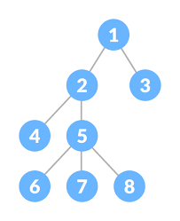
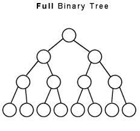
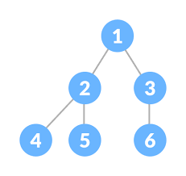

# 트리(Tree)구조란?

- 대표적인 비선형 자료구조.
- 데이터를 저장하고 있는 노드가 branch로 연결된 자료구조.
- 트리는 하나의 root노드를 시작으로 나무가 뒤집힌 모양과 비슷하다.

  

  
  </q>

## 트리의 종류

1. Binary Tree(이진 트리)

   - 각 node의 Child수가 최대 2개인 트리구조.
   - 이진트리에서도 Full Binary Tree와 Complete Binary Tree로 나뉨
     - Full Binary Tree
       - 모든 leaf node의 깊이가 같은 tree
       - leaf node가 아닌 node들은 모두 2개의 child를 갖는다.
         
     - Complete Binary Tree
       - 가장 깊은 깊이의 node들을 제외하고 왼쪽부터 꽉차있는 트리.
       - 만약 깊이가 k라면 최소 2^k만큼의 노드가 존재한다.  
         
     - Full Binary Tree는 Complete Binary Tree가 될 수 있지만 역은 성립하지 않을 수 있다.

2. Binary Search Tree(이진 탐색 트리)

   - 이진 트리에서 데이터의 검색을 효율적으로 하기위한 트리.
   - 예를 들어 루트 노드의 저장된 데이터보다 작거나 같은 데이터를 가진 노드 들은 왼쪽 서브트리, 큰 데이터를 가진 노드들은 오른쪽 서브트리에 배치하는 방식으로 데이터를 나누어 놓는다.
   - 데이터를 탐색하는데 있어 찾고 싶은 데이터와 현재 노드의 데이터 값을 비교하면서 노드를 이동하여 탐색하면 좀 더 효율적인 데이터 탐색이 가능하다.

     
