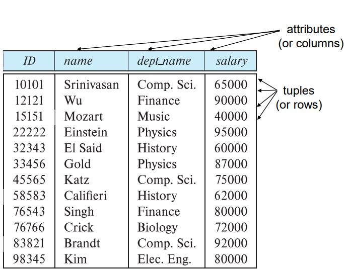

# Structure of Relational Databases


- Relation(관계)는 하나의 테이블로 생각 할 수 있다.
- 각 열(columns or attributes)은 특성을 나타낸다.
- 각 행(rows)은 튜플을 나타낸다. 열의 순서대로 데이터의 형태를 배치해야 한다.
## Relation Schema and Instance
- Schema = type, Instance = variable
- A<sub>1</sub>, A<sub>2</sub>, …, A<sub>n</sub>는 attributes.
- R = (A<sub>1</sub>, A<sub>2</sub>, …, A<sub>n</sub>)는 relation schema(관계 스키마)<br>
  ```sql
  instructor = (ID, name, dept_name, salary)
  ```
- 스키마 R 위에 정의된 관계 인스턴스 r은 r(R)로 표시된다.
- 관계 r의 요소 t는 튜플이라고 불리며 테이블 내의 행으로 표현된다.

## Attributes

- 각 Attribute의 허용되는 값 집합을 속성의 Domain이라고 한다. (Attribute의 타입: 정수, 문자열 ...)
- Attributes의 값은 atomic해야 한다.(한 Attributes에 값은 하나만 들어갈 수 있다. 한 칸에 하나의 데이터만 저장)
- null은 모든 Domain에 포함되어 있는 값이다.

#### Table에서 Attributes의 순서는 상관 없지만 row의 data type의 순서는 Attributes의 순서에 맞춰 모두 같아야 한다.

## Database Schema

- Database Schema : 데이터베이스의 논리적 구조
- Database instance : 완성된 Table

## Keys

- Key: Attributes의 부분집합.
- SuperKey: Table의 데이터를 구분할 수 있는 key, 여러개를 고를 수 있다.(흔히 고유한 값을 갖는 Attributes를 고른다.)
- Candidate Key(후보키): 최소한의 SuperKey로 이루어진 key
   - 후보키에서 하나라도 빠진다면 SuperKey가 될 수 없다.
- Primary Key: 여러가지 Candidate Key중에서 명확히 구분할 수 있는 고유한 하나의 key(절대 변하지 않는 고유한 값 ex. 주민등록번호, 학번)
- Foreign Key: 다른 Table key에 저장된 데이터를 사용 할때 사용하는 key
(참조하는 Table에 존재하는 Attributes만 사용할 수 있다.)
   - 참조 되는 table에서 key로서 사용하는 값을 사용한다.

## Relational Algebra

- 하나 또는 두 개의 관계를 입력으로 사용하고 그 결과로 새로운 관계를 생성하는 일련의 연산으로 구성된 절차 언어
- 조건문이 들어가는 언어에는 논리 연산자, 산술 연산자 모두 사용가능하다.
- Six basic operators
  1. Select Operation: 지정된 조건을 만족하는 튜플을 선택한다.
      - 산술 연산자, 논리 연산자를 사용할 수 있다.
     
  2. Project Operation: 특정 Attributes를 반환하는 단항 연산
     
  3. Cartesian-Product Operation: 임의의 두 관계 정보를 결합할 수 있다.
      - 가능한 모든 조합으로 테이블을 결합한다.
     
  4. Union: 두개의 table을 결합한다. (단, 두 table의 형태는 모두 같아야 한다.)
      - attributes의 수, 도메인이 일치해야한다.
     
  5. Set Difference Operation: 차집합의 형태로 어떤 관계에 있지만 다른 관계에는 없는 튜플을 찾을 수 있다.
      - attributes의 수, 도메인이 일치해야한다.
     
  6. The Rename Operation: 이름을 변경할 수 있는 연산자.
- Other operators
  1. Join Operation: Cartesian-Product Operation의 단점을 보완할 수 있는 연산자. 관련이 있는 정보들만 결합한다.
     
  2. Set-Intersection Operation: 두 Table에 모두 포함된 튜플을 찾는다.
     - attributes의 수, 도메인이 일치해야한다.
     
  3. The Assignment Operation: Table을 다른 Table에 대입할 수 있는 연산자.
     

## Equivalent Queries
- 서로 다른 Query문을 사용했지만 같은 결과를 반환하는 Queries
