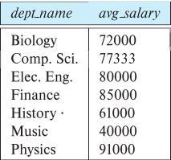

# Structured Query Language(SQL)

- DML, Intergrity, View definition, Transaction control, Embedded SQL and dynamic SQL, Authorization들로 이루어져 있다.

## Data Definition Language(DDL)

- Schema, Attributes의 type, Integrity, Indices(색인), 보안과 권한을 설정할 수 있다.

- Domain Types in SQL
  - `char(n).` n의 크기로 고정된 문자열
  - `varchar(n)` 최대 n의 크기까지의 가변길이 문자열
  - `int`, `smallint` 정수, 작은 정수
  - `numeric(p,d)` p개의 숫자를 소수점 d자리까지 정확하게 기억하는 Type
  - `real, double, precision` 실수
  - `float(n)` 최소 n개의 정수로 이루어진 실수

## Create Table Construct

- SQL Table은 `create table` 명령어로 생성 할 수 있다.<br>

  ```
  create table instructor (
                  ID char(5),
                  name varchar(20),
                  dept_name varchar(20),
                  salary numeric(8,2))
  ```

  table 이름이 instructor이고 ID, Name, dept_name, salary의 Attributes,각각 char, varcahr, varcahr, numeric의 Domain을 갖는 table을 생성한다.

- Integrity Constraints in Create Table
  - SQL은 무결정 제약 조건을 위반하는 데이터베이스 업데이트를 방지한다.
  - primary key (A1, ..., An ) : 기본키 설정
  - foreign key (Am, ..., An ) references r : 외래키 설정
  - not null : null로 setting 불가능
  ```
  create table instructor (
                  ID char(5),
                  name varchar(20) not null,
                  dept_name varchar(20),
                  salary numeric(8,2),
                  primary key (ID),
                  foreign key (dept_name) references department);
  ```

## Updates to tables

- Insert
  ```
  insert into instructor values ('10211', 'Smith', 'Biology', 66000);
  <!-- instructor table에 해당 tuple을 삽입 -->
  ```
- Delete
  ```
  delete from student
  <!-- student table의 모든 tuple 삭제 -->
  ```
- Drop Table
  ```
  drop table r
  <!-- r table 영구 삭제 -->
  ```
- Alter
  ```
  alter table r add A D
  <!-- r table에 새로운 Attribute, Domain type 추가, 처음에는 모두 null로 초기화 된다. -->
  ```

## Basic Query Structure

- 쿼리문은 대소문자를 구분하지 않는다.
- The select Clause

  - select 절은 쿼리 결과에 원하는 Attribute를 나열한다. (관계 대수에서 projction에 해당함)
  - where (instructor.ID, dept_name) = (teaches.ID, 'Biology'); 처럼 튜플단위로 비교가 가능함.
  - where salary <strong>between</strong> 90000 and 100000 (90000 <= salary <= 100000)

  ```
  select name
  from instructor
  <!-- instructor table에서 name을 모두 가져옴 -->

  select distinct dept_name
  from instructor
  <!-- instructor table에서 dept_name을 중복 없이 가져옴 -->

  select *
  from instructor
  <!-- instructor table의 모든 atrributes를 가져옴 -->

  select ID, name, salary/12
  from instructor
  <!-- select문에서 사직연산이 가능함. salary에서 12를 나눈 몫을 가져옴 -->
  ```

- The where Clause

  - where절은 결과가 충족해야하는 조건을 지정한다.(관계 대수에서 select에 해당함)
  - where절에서 논리 연산, 비교연산이 가능하다.

  ```
  select name
  from instructor
  where dept_name = 'Comp. Sci.'
  <!-- instructor table에서 dept_name가 Comp. Sci.인 사람의 이름을 가져옴 -->

  select name
  from instructor
  where dept_name = 'Comp. Sci.' and salary > 70000
  <!-- instructor table에서 dept_name가 Comp. Sci.인 사람 중 연봉이 70000보다 큰 사람의 이름을 가져옴 -->
  ```

- The from Clause

  - from 절은 쿼리에 관련된 관계를 나열한다.(관계 대수에서 e Cartesian product에 해당함)

  ```
  select *
  from instructor, teaches
  <!-- instructor, teaches의 Cartesian product를 가져옴 -->

  select name, course_id
  from instructor , teaches
  where instructor.ID = teaches.ID
  <!-- instructor, teaches의 Cartesian product를 그냥 가져오면 무의미한 데이터가 추가되므로 where절을 같이 사용하여 무의미한 데이터를 없앨 수 있음 -->

  ```

- The Rename Operation

  - as절은 table 및 attribute의 이름을 변경할 수 있음

  ```
  select distinct T.name
  from instructor as T, instructor as S
  where T.salary > S.salary and S.dept_name = 'Comp. Sci.’
  <!--  instructor table을 T와 S로 변경하여 간결하게 사용한다. -->
  ```

- String Operations

  - SQL에서 문자열 비교를 위한 문자열 일치연산자('%', '\_')가 포함됨
  - Example
    - 'Intro%' Intro로 시작하는 문자열
    - '%Comp%' Comp가 포함되어 있는 문자열
    - '\_ \_ \_' 정확히 3개의 문자로 이루어진 문자열
    - '\_ \_ \_ %' 3개 이상의 문자로 이루어진 문자열

- Ordering the Display of Tuples

  - 가져온 데이터를 정렬할 수 있음.

  ```
  select distinct name
  from instructor
  order by name
  <!-- 이름순으로 오름차순 정렬(order by name desc은 내림차순 정렬) -->
  ```

- Set Operations

  - union(두개의 table결합)
  - intersect(두개의 table에서 공통된 것을 추출)
  - exept(하나의 table에만 존재하는 데이터 추출)
  - 집합 연산은 중복된 데이터를 알아서 제거하여 추출한다. 집합 연산뒤에 all문을 사용하면 중복된 데이터를 제거하지 않고 추출한다.

- Null Values

  - null은 알려지지 않은 값(nukown)이다.
  - null은 사칙 연산, 비교 연산으로 판단하면 잘못된 결과를 가져올 수 있다.
  - null은 is null 또는 is not null로만 판별해야한다.

- Aggregate Functions(집계함수)

  - 여러개의 값을 입력받아 하나의 값으로 반환하는 함수
  - avg(A) : 해당 Atrribute의 평균값
  - count( ) : 해당 Attribute의 개수
    - count(disticnt A): 중복을 제외한 개수
    - count(\*): 모든 tuple의 개수
  - group by A : Tuple을 그룹단위로 집계한다.
    ```
    select dept_name, avg (salary) as avg_salary
    from instructor
    group by dept_name;
    ```
    
  - 집계함수를 사용할 때 select문에서 사용하지 않은 Attribute들은 `group by`에 포함되어 있어야한다.
    - having '조건문': 조건에 만족하는 집계를 출력한다.
    - where절은 집계함수 이전에 사용하는 조건문, having절은 집계함수를 사용한 후 작성해 준다.

- Nested Subqueries(중첩 서브쿼리)

  - select, from, where절에서 중첩으로 쿼리문을 사용할 수 있다.
  - where - Set Membership

    - 서브쿼리에 포함 여부를 판단한다. (where in, not in)
      ```
      select distinct course_id
      from section
      where semester = 'Fall' and year= 2017 and
            course_id (not) in (select course_id
                          from section
                          where semester = 'Spring' and year= 2018);
      ```
    - where - Set Comparison

      - 서브쿼리와 비교한다.

        ```
        select name
        from instructor
        where salary > some (select salary
                            from instructor
                            where dept name = 'Biology');
        <!-- 서브쿼리에 존재하는 값 중에서 조건을 만족하는 것이 하나라도 존재하면 선택한다. some 대신 in을 사용할 수 있지만, != some 대신 not in을 사용할 수 없다.-->
        ```

        ```
        select name
        from instructor
        where salary > all (select salary
                            from instructor
                            where dept name = 'Biology');
        <!-- 서브쿼리에 존재하는 모든 값에서 조건을 만족하면 선택한다. != all 대신 not in을 사용할 수 있지만, all 대신 in을 사용할 수 없다.-->
        ```

    - where - exists, not exists
      - 서브쿼리가 비어있는지 비어있지 않은지를 판단한다.
    - where - unique

      - 모든 Tuple의 값이 일치하지 않는지 판단한다. 단, 공집합은 True를 반환한다.

    - from
      - from절 뒤에 서브쿼리를 작성하고 서브쿼리에 존재하는 속성들을 가져온다.
      ```
      select dept_name, avg_salary
      from ( select dept_name, avg (salary) as avg_salary
             from instructor
             group by dept_name)
      where avg_salary > 42000;
      ```
    - with
      - 쿼리에서 사용될 임시 relation을 만든다. 보통 주어진 Table로부터 원하는 정보를 즉시 추출하기 어려울 경우에 사용한다.
      ```
      with max_budget (value) as
           (select max(budget)
           from department)
      select department.name
      from department, max_budget
      where department.budget = max_budget.value;
      ```
    - Scalar Subquery
      - selec문에 사용하는 서브쿼리, 하나의 값을 가져오는 쿼리만 작성해야 한다.
      ```
      select dept_name,
            ( select count(*)
              from instructor
              where department.dept_name = instructor.dept_name)
              as num_instructors
      from department;
      ```

- Modification of the Database

  - Deletion : 삭제 쿼리
    ```
    delete from instructor
    <!-- 모든 속성 삭제 (빈 테이블)-->
    delete from instructor
    where dept_name = 'Finance’;
    ```
  - Insertion : 새로운 튜블 삽입

    ```
    insert into course
    values ('CS-437', 'Database Systems', 'Comp. Sci.', 4);
    ```

  - Updates : ralation의 data수정

    ```
    update instructor
    set salary = salary * 1.05

    update instructor
      set salary = case
                    when salary <= 100000 then salary * 1.05
                    else salary * 1.03
                   end
    ```
