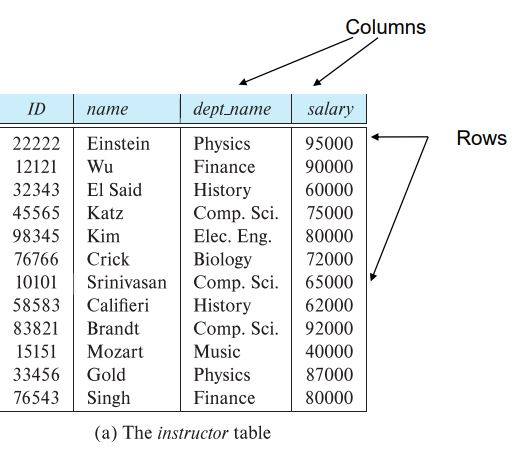
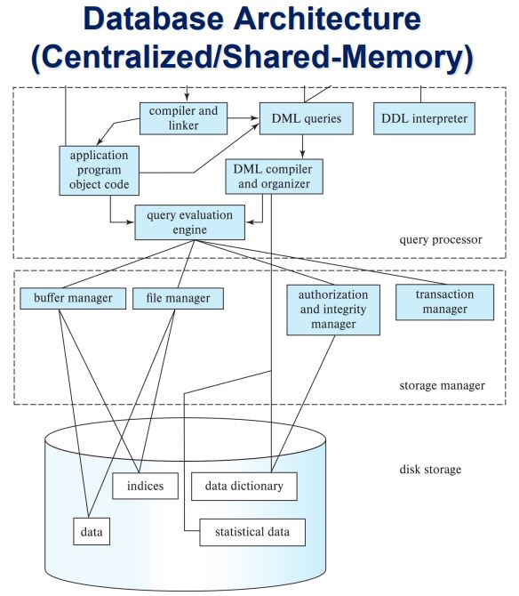

# Database

- 여러 사람이 공유하여 사용할 목적으로 체계화해 통합, 관리하는 데이터의 집합

# 데이터베이스 시스템이 해결하는 문제

- 데이터의 불필요한 중복과 불일치 문제
- 데이터 접근의 어려움 문제
- 데이터 분리 문제(파일의 형태에 맞게 프로그램을 설계해야 함)
- 데이터 무결성(정확성) 문제(제약 조건을 만족하지 못하는 데이터가 저장될 가능성이 있음)
- 데이터 갱신의 원자성 문제(어설픈 상태로 업데이트가 완료되면 안된다)
- 다수 유저의 동시 접근 문제
- 보안 문제 

# Data Models
- 데이터를 설명하는 모델(ex. 관계 모델, 관계-개체 모델)
## Relational Model

- 모든 데이터는 다양한 table에 저장된다.
  

# Data Definition Language (DDL)

- 데이터베이스의 schema(테이블의 columns)를 정의하는 언어이다.

  Example

  ```
  create table instructor (
            ID char(5),
            name varchar(20),
            dept_name varchar(20),
            salary numeric(8,2))
  ```

- DDL 컴파일러는 `data dictionary`에 저장된 table을 생성한다.
- `data dictionary`는 메타데이터를 포함하고 있다
  - Database schema
  - Integrity constraints
    - Primary key
  - Authorization
    - 데이터 접근 권한

# Data Manipulation Language (DML)

- 데이터를 관리하기 위한 언어(a.k.a query language)
- DML은 기본적으로 두 종류의 언어가 있다.
  - Procedural(절차적) DML : 특정 방식으로 특정 데이터를 가져 오도록 명령하는 언어.
  - Declarative(비절차적) DML : 특정 데이터를 가져오기만 하는 언어.

## SQL Query Language

- SQL은 대표적인 비절차 언어임.
- 입력으로는 여러개의 테이블을 받을 수 있고 항상 하나의 테이블을 반환한다.
- SQL은 표현 범위가 좁기 때문에 단독으로 사용되지 않고 다른 프로그래밍 언어와 같이 사용된다.

```
  select name
  from instructor
  where dept_name = 'Comp.Sci'
```

# Database Engine

데이터베이스 시스템은 시스템 전체의 각 관리영역을 처리하는 모듈로 분할된다.

1.  Storage Manager

    - 데이터베이스에 저장된 낮은 수준의 데이터와 시스템에 제출된 응용 프로그램 및 쿼리 사이의 인터페이스를 제공하는 프로그램 모듈
    - OS file manager와 상호작용함
    - 효율적인 저장, 데이터를 가져오고 업데이트 함
    - Date files(Data base 자신), Data dictionary, Indices(색인, 포인터)를 가지고 있음

2.  Query Processor 구성요소

- DDL interpreter : 데이터베이스가 이해 할 수 있도록 DDL을 해석해서 data dictionary에 저장한다.
- DML compiler : DML을 기계어로 번역한다.
- 모듈 자신이 판단해서 가장 효율적인 방식으로 명령어를 처리한다.

3. Transaction Management

- Transaction : 데이터베이스 앱에서 하나의 함수처럼 동작하는 여러개의 연산 집합, 여러개의 연산이 별도의 연산으로 취급되면 문제가 발생할 때 하나의 Transaction으로 취급한다.
- Transaction-management component : 시스템에 문제 발생 시 데이터베이스가 올바른 정상상태를 유지하도록 한다.
- Concurrency-control manager : Transaction이 동시에 동작해도 데이터베이스에 문제가 생기지 않도록 하는 기능이다.

  
  데이터베이스 구조
