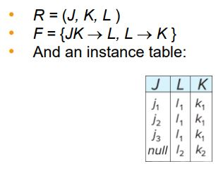

# 정규화(Nomalization)
- 데이터베이스의 구조화를 수행하는 작업
- 구조화는 데이터의 중복을 줄이고 무결성을 향상시키기 위해 수행한다.
  - Entity 무결성: 기본키는 유니크해야 하며, null이면 안된다.
  - 참조 무결성: 데이터 베이스가 참조하는 개체에 참조하는 데이터가 존재해야 한다.
- 좋은 데이터 구조를 지니도록 데이터베이스의 스키마를 설계할 때 도움을 줄 수 있는 도구
- 정규화 이론에 따라서 해당 테이블이 좋은 형태가 아니라고 판단될 때 테이블을 분해할 수 있다.

## 제 1 정규형
- 모든 데이터는 atomic해야 한다는 조건만 있다.
- 데이터의 중복이 일어날 가능성이 있음

## 제 2 정규형
- 제 1 정규형의 문제를 해결하도록 만들어진 정규형
- 모든 데이터가 atomic해야하고, 튜플의 후보키 일부만 가지고 결정되는 어트리뷰터가 있으면 안된다. 만약 그런 데이터가 있다면 테이블을 따로 만들어 줘야함.

# 좋은 관계형 데이터베이스의 특징
## 중복되는 데이터가 없다.
- 데이터베이스 설계시 중복되는 데이터가 있다면 테이블을 분해하자.
  - 하지만 모든 분해가 좋지는 않다.
  - 분해를 할 때 겹치는 어트리뷰트가 있을 때 같은 값을 가지고 있으면 안된다.
  - 분해하고 join했을 때 분해 전 데이터베이스와 다르다면 정보의 손실이 일어난 것이다.
  - 손실 없이 분해하는 법: 분해 한 Table을 join 했을 때 분해 전 테이블과 같아야 함

## 함수적 종속성을 유지
- 함수적 종속성
  - 한 어트리뷰트의 값이 같다면 해당하는 값에 대한 다른 어트리뷰트의 값이 같아야 한다. ex) 같은 ID는 같은 name을 갖는다. 하지만 name이 같다고 해서 ID가 같지는 않다. ID -> name, name -> ID(x)
  - 함수적 종속성은 key와 관련이 있다.
    - 기본키로 모든 어트리뷰트의 값을 결정지을 수 있다. 

- 데이터베이스가 업데이트될 때마다 함수적 종속성을 테스트하는데 비용이 많이 들 수 있다.
- 종속성을 효율적으로 테스트할 수 있는 방식으로 데이터베이스를 설계하는 것이 유용하다.
- 한 가지 relation만 고려하여 종속성을 시험한다면 테스트 비용이 저렴하다.
- 함수 종속성을 강제하기 어렵게 만드는 분해는 종속성 보존이 아니라고 한다.
- table을 분리하게 되면 존재하는 함수적 종속성이 깨질 수 있다. 때로는 분해하지 않는게 좋을 수도 있다.

## Closure
- 성립하는 함수적 종속성의 집합으로 추론해 낼 수 있는 모든 함수적 종속성의 집합이다.
  - ex) `A -> B`, `B -> C` => `A -> C`(closure)
- 핵심적인 함수적 종속성만 기제하고 나머지는 클로저로 작업 

## Key와 함수적 종속성
- superkey는 관계에 있는 모든 어트리뷰트가 같다. (ex. ID가 뭐라면 다른 값들은 이거여야 한다.)
- 후보키도 마찬가지, 하지만 후보키보다 더 적은 어트리뷰트를 사용해 튜플을 구분 지을 수 있으면 안된다.
  - ID, name -> R, ID -> R {ID, name}은 후보키가 될 수 없다.

## 함수적 종속성의 쓰임
- 테스트, 명시
- 주어진 릴레이션이 적법한지 테스트
- 테이블을 설계 할 때 제약 조건(기본키 설정 등)으로 설정 가능
- 함수적 종속성이 없는데 특정한 인스턴스에서 종속성이 있는 것처럼 보일 수 있으니 주의하자.
  - 유니크한 값인지 판단해주자

## 함수적 종속성을 활용한 무손실 분해
- 분해한 릴레이션에서 겹치는 어트리뷰트가 분해한 릴레이션을 결정 할 수 있다면 무손실 분해
  - R1 $\cap$ R2 -> R1
  - R1 $\cap$ R2 -> R2
  - 둘 중 하나가 만족되면 무손실 분해!

## Boyce-Codd Normal Form

- 한 table(R)에 존재하는 모든 함수적 종속성이 다음을 만족하면 BCNF라고 부른다. (A → B)
- (A → B is trivial) or (A이 R의 superkey이다.) 
  Exmaple) ID → building (BCNF, ID is super key), dept_name → building (X)
- 어떤 table에서 함수적 종속성이 존재하는데 그것이 BCNF가 만족하지 않을때, 그 종속성에 포함된 attributes를 따로 분리한다. 이때 함수적 종속성에 관련이 있는 것들은 가능한 모두 분리해야한다. 
- Example 
  R = (A, B, C), F = (A → B, B → C)
  1. R1 = (A, B), R2 = (B, C)
     - R1 $\cap$ R2 = {B} and B → BC : 데이터 손실이 일어나지 않고 함수적 종속성이 유지됨.
  2. R1 = (A, B), R2 = (A, C)
     - R1 $\cap$ R2 = {A} and A → AB: 데이터 손실이 일어나지 않지만 B → C 함수적 종속성이 깨짐.

## Third Normal From(제 3정규형, TNF)

- 한 table(R)에 존재하는 모든 함수적 종속성이 다음을 만족하면 제 3정규형을 만족한다. (A → B)
- (A → B is trivial) or (A이 R의 superkey이다.) (= BCNF 조건)
- B - A, B에만 속한 Atrributes가 R의 candidate key(후보키)다.
  - 각 Attribute는 서로 다른 후보키에 속해있을 수 있고, 한 후보키에 속해 있으면 된다.
- TNF는 BCNF의 조건을 포함하고 있기 때문에 BCNF를 만족하면 TNF를 만족한다. 역은 성립하지 않을 수 있다.
- TNF는 정보가 중복되는 문제, null value를 사용해야하는문제가 있지만 분해하지 않아도 되기때문에 정보손실이 일어나지 않고, 함수적 종속성을 유지할 수 있다.
  
- Example
  - (s_ID, i_ID, dept_name)
  - candidate key = (s_ID, i_ID), (s_ID, dept_name)
  - 함수적 종속성: (i_ID → dept_name), (s_ID, dept_name → i_ID)
  - 첫 번째 종속성은 BCNF에 포함되지 않지만 dept_name가 candidate key에 존재한다. 두 번쨰 종속성은 s_ID, dept_name이 superkey이므로 이 table은 제3 정규형을만족한다.

## Goals of Normalization(정규화의 목적)

- relation R이 함수적 종속성 F를 가지고 있다고하자.
- 정규화는 R이 좋은 형태인지 아닌지 판단할 수 있다.
- R이 좋은 형태가 아니라면, R을 분해하여 분해된 reltion들이 좋은 형태인지 판별하고, 정보 손실이 일어나지 않았는지, 함수적 종속성을 유지했는지 판단할 수 있다.

## BCNF는 얼마나 좋은가?

- table에 함수적 종속성이 없다면 BCNF를 만족한다. 이는 불필요한 정보를 추가할 가능성이 있다는 것이다.

## Design Goals

- (BCNF, 정보 무손실, 함수적 종속성 유지)의 조건을 맞출 수 없는경우 (함수적 종속성 유지, 3NF)로 설계하자.
- 함수적 종속성은 중요하지만 SQL에서 테스트하기에는 비용이 크고 비효율적이다. SQL에서는 기본키를 이용해야 함수적 종속성을 표현할 수 있다.
- table을 나눴을 때 join을 많이 한다 -> 3NF, 그렇지 않다 -> BCNF

## Multivalued Dependencies (MVDs)

여러개의 값을 가지는 Attribute를 결정할 수 있는 종속성 
표현법: A →→ B
A가 정해졌을 때 B를 여러개 소유하고 있다. B는 Multivalued Attribute이다. A는 B의 모든 조합을 가지고 있다. 만약 모든 조합을 가지고 있지 않다면 다치 종속성은 성립되지 않는다.