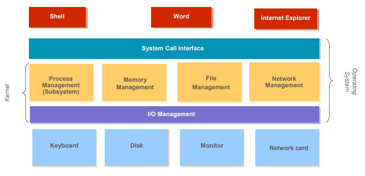

# 운영체제란?

- 리소스를 제어하고 할당하는 공통 기능이 포함된 하나의 소프트웨어.
- 컴퓨터를 사용하는 유저와 컴퓨터 하드웨어 사이에서 동작한다.
- 컴퓨터가 실행되는 동안에 항상 동작하며, 흔히 커널(Kernel)이라고 불린다.

## 1. 운영체제의 목적

- 사용자 프로그램을 실행한다.
- 표준 라이브러리를 제공하고, 사용자의 문제해결을 쉽게 할 수 있도록 한다.
- 컴퓨터 사용을 쉽게 만든다.
- 컴퓨터 하드웨어를 효율적으로 사용한다.

## 2. 운영체제의 역할

1. 사용자의 관점
   - 사용자가 수행하는 작업을 최대화 한다.
2. 시스템의 관점
   - 리소스를 할당하고 관리한다.
   - 프로그램을 실행을 제어하여 오류 및 컴퓨터의 부적절한 사용을 방지한다.

## 3. 운영체제의 구조

 
(사용자는 System Call Interface를 활용해 Kernel에 접근할 수 있다.)

## 4. 듀얼 모드

- 운영체제는 듀얼 모드 운영을 통해 자체 시스템, 기타 시스템 컴포넌트를 보호 할 수 있다.

  - <strong>User mode</strong> and <strong>kernel mode</strong>
  - User mode에서는 직접적으로 Kernel mode로 진입할 수 없다.

- 실행중인 프로그램에서 예기치 못한 오류가 발생하면 Exception이 발생해 User mode에서 Kernel mode로 이동 후 오류를 처리한다.
- 혹은 Interrupt가 발생해도 mode의 변경이 일어난다.
- 모드의 이동이 발생하는 경우는 System Call, Process Timer Interrupt, Interrupt, Exception의 경우가 있다. 이 중에서 System Call만이 사용자가 합법적으로 Kernel에 접근할 수 있는 방법이다.
