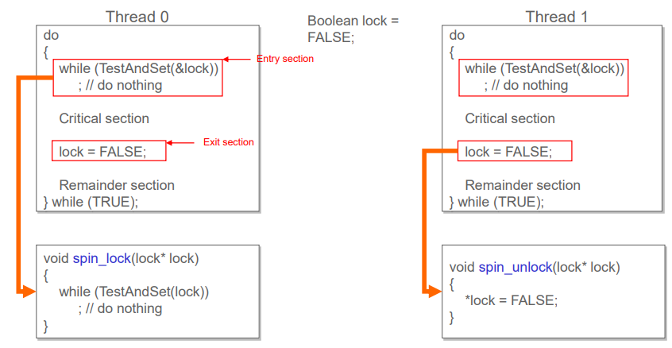
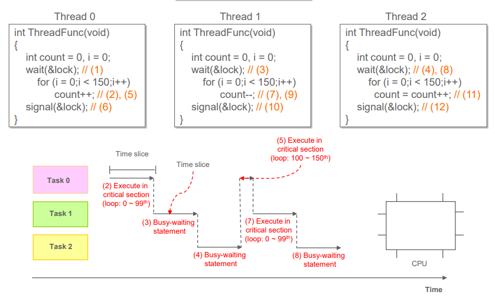
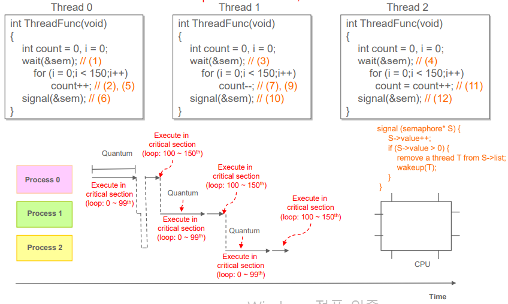
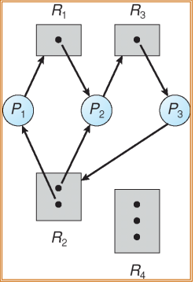

# Synchronization
- 스레드를 지원하는 운영체제에서 실제로 운영체제에 의해 스케쥴링되는 것은 커널 스레드다.
- Multiprogramming
    - CPU의 활용성 최대화
    - I/O 요청으로 인해 프로세스가 대기해야 할 경우 CPU의 control은 Ready Queue에 있는 다른 프로세스가 부여된다.
    - 동기화는 Process, Thread가 공통으로 접근하는 데이터가 있을 때 한번에 하나의 Process, Thread가 접근하도록하게 만드는 것을 의미한다.

## Race Condition
- 여러 스레드가 동시에 동일한 데이터에 액세스하고 조작하는 상황을 race condition이라고 하며, 실행의 결과는 액세스가 수행되는 특정 순서에 따라 달라진다.
- C code를 기계어 단계로 해석하면 왜 결과가 올바르지 않은지 알 수 있다. 같은 데이터에 접근하는 서로다른 스레디의 Context switch로 인해 데이터 조작이 제대로 이뤄지지 않을 수 있다.

## Critical Section
- 프로그램의 공유 메모리 또는 리소스가 여러개의 프로세스로부터 액세스되는 부분.
- Synchronization: Race condition or Critical section problem을 해결하는 프로토콜
- Critical section의 입구와 출구
    - 프로세스에서 critical section에 진입할 권한을 요청해야한다.
    - Entry section: 요청을 구현하는 코드 세그먼트
    - Exit section: critical section의 종료를 알리는 코드 세그먼트
    ```
    Entry section
    
    ...
    Critical section
    ...

    Exit section
    ```

## 동기화가 잘 이뤄지는 조건
1. Mutual Exclusion - 한 스레드가 critical section에 접근 중이면 다른 스레드는 영역에 접근하지 못하도록 막는것. 한 스레드가 critical section을 독점한다. 사용중인 스레드가 영역을 빠져나와야 다른 스레드가 접근할 수 있다.<br>
(이 부분만 제대로 구현되어도 상당부분 동기화가 이루어진다.)
2. Progress - critical section를 점유하고 있는 스레드가 영역을 빠져나오면 다음 스레드를 별다른 지연없이 곧바로 접근할 수 있도록 하는것.

3. Bounded Waiting - critical section에서 대기하고 있는 스레드의 waiting time을 제한하여 critical section에 접근하지 못하는 스레드가 없도록 하는것.
<br>
<br>
위 세 가지의 조건을 만족하면 동기화가 이루어 질 수 있다.

### Synchronization: Lock
- Lock - 동기화의 기본적인 메커니즘, mutex라고도 부른다.
```
acquire lock (Entry section)

Critical section

relaease lock (Exit section)
```
- Mutex
    - critical section의 상태를 나타내는 특수 변수를 사용한다.
        - locked state: critical section에 접근 중인 스레드가 존재함, mutex를 보유 중인 스레드가 존재함.
        - unlocked state: mutex를 잡고 있는 스레드가 없음.
        - lock 상태에서 스레드들이 접근할 때 unlock이 되면 FIFO, ciritical section에 먼저 접근한 스레드부터 뮤텍스를 잡고 영역에 진입한다.

- Spin Locks(Hardware solution)
    - TestAndSet CPU 명령을 통해 구현할 수 있다.
    - 리소스가 spin lock으로 보호되는 경우 리소스를 획득하려는 스레드는 리소스가 잠금 해제될 때까지 대기상태(무한 루프)가 된다.
    ```
    boolean TestAndSet (boolean *target)
    {
        boolean old = *target;
        *target = TRUE;
        return old:
    }
    ```


## Semaphore
- 다양한 하드웨어 솔루션은 개발자들이 사용하기에는 복잡하다.
- 반면 세마포어는 덜 복잡하고, 세마포어 카운트라는 변수를 이용해 동기화를 구현할 수 있다.
- 세마포어 카운트(S)는 두 개의 분할 할 수 없는 함수 wait(), signal()을 통해서만 액세스 할 수 있다.
- 프로세스가 세마포어 값을 wait() 또는 signal()로 수정하면 다른 프로세스에서는 동시에 동일한 값을 같은 함수로 수정할 수 없다.(동기화)
```
wait(int* pCount){
    while(pCount <= 0);
    (*pCount)--;
}

signal(int* pCount){
    (*pCount)++;
}
```
- 세마포어 카운트는 제한된 수의 개체 또는 인스턴스로 구성된 리소스에 대한 액세스를 제허하는데 사용된다.
- 세마포어가 사용 가능한 리소스 수로 초기화된다.
- Binary semaphore
    - 정수 값의 범위는 0~1사이다.(세마포어 카운트를 1로 초기화)
    - 뮤텍스와 동작이 같다.
```
Semaphore S; //init to 1

wait(&S);

    critical section

signal(&S);
```

- 문제점
    - 세마포어가 스핀(무한루프)로 구현되어있으면 스레드가 critical section에 있는 동안 같은 영역에 들어가려고 하는 다른 스레드는 Entry Code에서 연속적으로 루프되어야 한다.
    - 그 결과 사용량이 많은 작업에서는 호출 스레드가 시간 퀀텀을 만료할 때까지 CPU시간을 사용하여 다른 스레드가 CPU를 사용하지 못하도록 한다.
        
    - 이를 해결하려면 critical section에 진입을 기다리고 있는 스레드는 스핀될것이 아니라 sleep, block 상태(waiting)로 변경시켜서 기다리는 동안 CPU를 사용하지 않도록 해야한다.
    ```
    typedef struct{
        int value;
        struct thread* list;
    }semaphore;

    wait(semaphore* S){
        if(S->value <= 0){
            add this thread to S-> list;
            block();
        }
        S->value--;
    }

    signal(semaphore* S){
        S->value++;
        if(S->value > 0){
            remove a thread T from S->list;
            wakepu(T);
        }
    }
    ```
    

## Deadlock
- 서로 다른 두 스레드가 각각 리소스를 점유한 상태에서 다른 리소스를 요청하는 상태
- Deadlock 발생조건
    1. Mutual exclusion: 오직 한번에 하나의 스레드만 리소스를 사용할 수 있다.(동기화)
    2. Hold and wait: 리소스를 잡고 있는데 다른 자원을 요청한다.
    3. No preemption: 리소스는 스레드가 작업을 완료한 후, 해당 스레드를 보유하는 스레드에 의해서만 자발적으로 해제할 수 있다. (OS or 다른 스레드에서 해제 불가)
    4. Circular wait: 대기중인 스레드 집합{T0, T1, ..., T0}가 존재한다. T0는 T1이 점유중인 리소스를 요청하고, T1은 T2가 점유중인 리소스를 요청한다.

