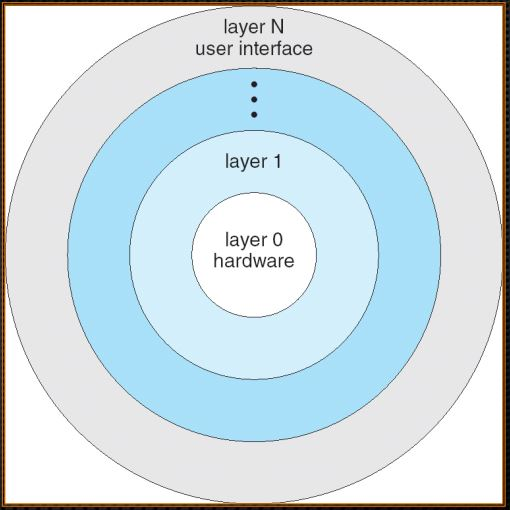
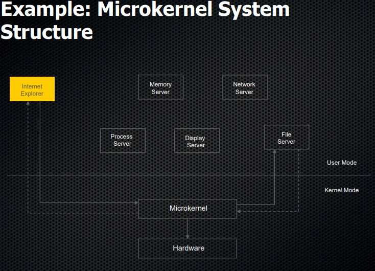
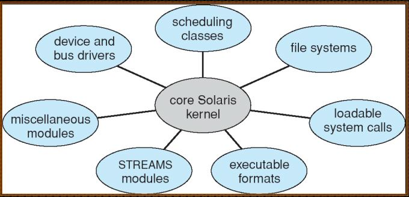
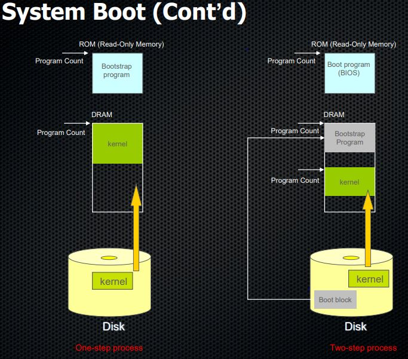

# Operating System Structures

## 1. User Operating System Interface

- CLI : 명령어를 기반으로 컴퓨토를 운영.
- Desktop : 마우스, 키보드, 모니터를 이용해서 컴퓨터를 운영(GUI).
- 대부분의 시스템은 CLI, GUI를 모두 제공한다.

## 2. System Call and API

- System Call : OS가 제공하는 서비스에 대한 프로그래밍 인터페이스
- API : OS보다 위 계층에 위치하는 Middle Ware가 제공하는 함수들.
  - API를 이용해 어플리케이션을 만들 수 있다.
  - OS의 내부동작을 몰라도 개발이 가능하도록 도와준다. 개발자들은 System Call을 직접 사용하는 것보다 API를 사용하는 것이 더 좋다.
  - API들은 내부적으로 System Call을 이용하도록 구현되어 있다.
  - 하지만 API별로 호환되는 OS들이 따로 존재한다.
    - ex) Posix, win32


## 3. System Call Implementation

- System Call Number : System Call 종류마다 대응되는 숫자.
- System Call Table : System Call을 정의하고 있는 Table(배열).

  ```
  // read in Posix
  int read(int fd, void* pBuf, int nBytes);
  ```

  ```
  // low level
  #define __NR_read 3
  _syscall3(int, __NR_read, int, fd, void*, pBuf, int, nBytes);
  ```

  - 구현된 것을 보면 먼저 System Call Number를 먼저 정의한다.
  - 그다음 \_syscall3과 같이 선언한다.
  - 함수의 매개변수는 (int(errupt), sysnum, type1, name, type2, name ...);로 이루어진다.

## 4. System Call Parameter Passing

- System Call에서 다수의 매개변수를 CPU레지스터에 전달하기 위해 `Block`을 만들어 `Block`의 시작주소만을 CPU에 전달한다.
  
  - x가 parameter의 `Block`이다.
  - window는 `stack`을 사용한다.

## 5. Layered Approach

- 여러 레이어(레벨)로 나뉘며, 각 레이어는 하위 레이어 위에 구축된다. 맨 아래 레이어(레벨 0)는 하드웨어, 가장 높은 레이어(레이어 N)는 user interface다.
  

- 바로 아래에 위치한 layer를 호출하며, 깊은 계층으로 이동한다.
  반드시 한 계층씩 이동해야하고, 낮은 계층의 layer가 높은 계층의 layer를 호출하는 것은 불가능하다. 서로 같은 계층끼리는 호출 가능하다.

- 장점
  - 디버깅과 구현이 쉽다.
- 단점
  - 다양한 layer를 적절히 정의하기는 어렵다.
  - layer의 호출이 많아지면 시스템에 부하가 걸릴 수 있다.
  - layer를 추가 할 때 상위 계층의 layer를 수정해야 한다.

## 6. Microkernel System Structure

- Layered Approach의 단점 중 하나인 새로운 layer추가 할 때 생기는 문제점을 해결할 수 있는 시스템 구조다.
- kernel이 최소한으로 필요한 기능(프로세스, 메모리, 동기화, IPC)들만 포함하고, 나머지 기능들은 user mode에서 동작하게 하는 구조다.
  
- 장점
  - 새로운 기능을 추가하기가 layer approach보다 쉽다.
- 단점
  - 너무 많은 기능이 user mode에서 동작한다면 시스템에 부하가 걸릴 수 있다.

## 7. Modules

- 객체 지향 접근법을 사용한다.
- OS에서 그때그때 필요한 Module(ex. 키보드, USB)만 커널에 동적으로 로드하여 동작할 수 있다.
- layer와 비슷하지만 더 유연한 구조다.

  

## 8. Virtual Machines

- OS와 하드웨어를 새로운 하나의 하드웨어처럼 보여주는 기계

## 9. System Boot

- Booting : 컴퓨터 실행과정에서 커널을 로드하는 과정
- Bootstrap program (or boot loader, BIOS)

  - Step 1: 기계들의 상태를 점검한다.(DRAM and devices)
  - Step 2: 커널을 main memory에 로드하고 실행한다.

- Two-step booting process (Linux, Unix, and Windows OS)
  - Step 1: 시스템 상태를 진단하고, boot block
    (Mast Boot Record, MBR)을 로드하고 실행한다.
  - Step 2: boot block의 코드는 운영체제 전체를 main memory에 로드한다.


