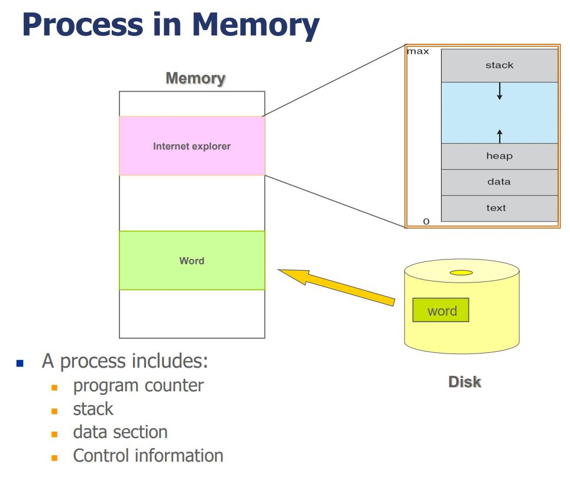
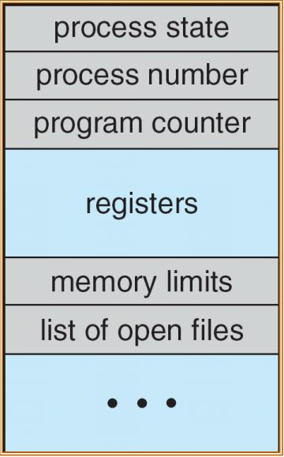
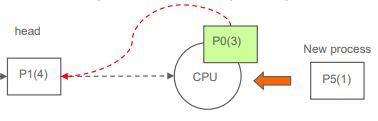

# Process

## Process Concept

- 프로그램: 컴파일 후 생성된 실행파일
- 프로세스는 실행중인 프로그램(.exe)이다.
  - 프로세스는 자신만의 자원(메모리, 파일, 소켓 ...), 메모리 공간, 제어 정보, Program count를 가진다.
  - process in memry
    
    - text: 프로세스의 코드를 저장
    - initialized data: 초기화된 전역변수(초기화되지 않은 전역변수는 unitialized data에 저장)
    - heap: 동적 메모리 공간
      - 주소가 증가하는 방향으로 메모리 할당
    - stack: 프로세스 메모리 공간(지역변수, 함수)
      - 주소가 감소하는 방향으로 메모리 할당
    
### Process State

- new : 프로세스가 완전히 만들어지기 전 단계
- ready : 실행되기 전에 CPU에 올라온 프로세스
  - 프로세스가 CPU상으로 옮겨지면 바로실행.
- running : 실행 중인 프로세스
  - 지정된 시간동안 CPU를 점유한 프로세스는 ready상태로 넘어감.
- waiting : CPU밖에서 ready상태로 전환되기를 기다리는 프로세스
  - I/O event, 특정 event가 발생하면 waiting상태로 전환된다. 이벤트가 완료되면 ready상태로 이동.
  - ready상태를 거쳐서 running상태로 가야한다. 다시 ready로 넘어갈 때는 가장 뒤 순서로 이동.
  - 프로세스가 CPU상으로 옮겨져도 실행되지 않음.
- terminated : 프로세스 종료
  - 종료된 프로세스의 리소스를 처리해줘야 한다. 그렇지 않으면 zombie상태의 프로세스가 되어버린다.

### Process Control Block(PCB)

- 프로세스의 정보를 담고 있는 구조체.

  - Process State
  - Program counter: 다음으로 실행할 명령어의 주소
  - CPU register
  - CPU scheduling informaion
  - Memory management information
  - Accounting information: 해당 프로세스가 CPU를 얼마만큼 차지하는가
  - I/O status information(file descripter table)

    

### Process Scheduling

- 다음으로 실행될 프로세스를 결정한다.
- 멀티프로그래밍, Time-shareing(여러 사용자가 컴퓨터에 접근 할 수 있는 기능)을 지원한다.
- CPU Switch Process from to Process: CPU가 서로다른 프로세스를 실행하는 과정
  1. 실행중인 프로세스를 변경해야 하는 상황(I/O, event ...)일 때 프로세스의 상태를 PCB에 저장
  2. 다음 프로세스의 상태를 CPU에 로드하고 실행
  3. 1번과 2번 반복
- Process Scheduling Queue
  - Process Scheduling Queue에는 PCB가 저장된다.
  - Job Queue : 모든 프로세스를 관리하는 큐
  - Ready Queue : ready상태에 놓여 있는 프로세스를 관리하는 큐
  - Device Queue : device I/O로 인해 waiting상태인 프로세스를 관리하는 큐
  - Waiting Queue : 리소스(메시지 큐, 소켓, 세마포어 등)를 사용하느라 waiting상태에 놓인 프로세스를 관리하는 큐
- Process Scheduler
  - 어떤 프로세스를 CPU에서 실행될지 결정
- Context Switch

  - CPU 레지스터에 저장된 PCB를 다른 PCB로 교체하는 작업 = 실행중인 프로세스를 다른 프로세스로 바꾸는 작업

### Process Creation

- 프로세스는 생성될때 고유한 ID를 갖는다.
- 자식 프로세스를 생성 할 경우 부모 프로세스의 리소스는 자식으로 모두 복사된다.
- 모두 복사할 때 리소스의 용량이 많을 경우 CPU에 부하가 걸릴 수 있으므로 공유 메모리를 사용하여 위험을 방지 할 수 있다.
  - 자식 프로세스에 새로운 메모리를 할당하는 것이 아닌 부모 프로세스의 메모리를 자식 프로세스가 함께 사용하여 리소스를 복사한것과 같은 효과를 낸다.
- 자식 프로세스가 부모 프로세스에서 변경한 데이터에 접근 할 수 없다.
- 변경한 데이터는 부모, 자식 자신들만의 메모리에 기록해야 한다.
- IPC
  - 메시지 시스템
  - 공유 메모리

# Process Scheduling

- CPU에 어떤 프로세스를 선택해서 실행할 것인가를 선택하는 작업.
- MultiProcessing을 위한 작업이다.

## CPU-I/O Burst Cycle

- 프로세스는 CPU burst(CPU가 명령어를 실행하는 구간)와 I/O burst(I/O가 완료될때 까지 기다리는 구간)이 번갈아가며 실행된다.
- I/O bound process: CPU burst가 짧고, I/O burst가 긴 프로세스
- CPU bound process: CPU burst가 길고, I/O burst가 짧은 프로세스

## Process Scheduler

- Process scheduler는 <u>ready queue</u>에 대기중인 프로세스 중에서 실행 할 프로세스를 선택한다.

- 프로세스 스케쥴링이 일어나는 상황

  1. running 상태 프로세스가 waiting 상태로 전환 될 때(I/O or event).
  2. running 상태 프로세스가 time slice를 넘겨서 실행된 경우.
  3. 프로세스가 종료되었을 때.

- Non-preemptive scheduling
  - 프로세스가 자발적으로 waiting상태가 종료하지 않는다면 프로세스 종료시까지 프로세스간의 전환이 일어나지 않도록 하는 스케쥴링
- Preemptive scheduling

  - 강제적으로 실행되고 있는 프로세스를 정지시키는 스케쥴링.

- Dispatcher는 선택된 프로세스를 CPU에 올리는 역할을 한다.

  1. switching context
  2. CPU에 새롭게 올린 프로세스가 종료된 시점부터 다시 시작하도록 한다.
  3. process를 실행하도록 user모드로 전환한다.

## Scheduling Criteria(기준)

- 어떤 스케쥴링 알고리즘을 쓸것인가에 대한 기준

1. CPU utilization: CPU를 가능한 바쁘게 유지해야한다.
2. Throughput: 주어진 시간안에 가능한 많은 프로세스를 실행해야한다.
3. Turnaround time: 프로세스가 실행되고 끝날때 까지의 시간을 최소화해야한다.
4. Waiting time: 프로세스가 ready queue에서 대기하고 있는 시간을 최소화해야한다.(waiting queue에 있는 프로세스는 해당되지 않음)
5. Response time: 어떤 event를 받아서 결과를 출력하는데 걸리는 시간을 최소화해야한다.

## Scheduling Algorithms

- ready queue에 있는 프로세스를 선택해서 CPU에 올리는 알고리즘.

1. First-Come, First-Served (FCFS, FIFO) Scheduling

   - 먼저 ready queue에 들어온 프로세스부터 CPU에 올린다.
     
     

2. Shortest-Job-First (SJF) Scheduling

   - CPU burst time이 짧은 프로세스부터 실행시킨다.
   - 하지만 이 알고리즘은 다음 프로세스의 CPU burst time을 알아낼 방법이 없이 때문에 구현이 어렵다.
     

3. Priority Scheduling

   - 각 프로세스마다 우선순위를 부여해 우선순위가 높은 프로세스 먼저 실행한다.
   - SJF알고리즘도 Priority Scheduling에 포함된다.
   - Preemptive방식
     - 만약 현재 실행중인 프로세스보다 높은 우선순위의 프로세스가 생성되었다면 현재 실행중인 프로세스를 ready queue로 보내고 새로운 프로세스를 실행한다.
       
   - non-preemptive방식 - 현재 실행중인 프로세스보다 높은 우선순위의 프로세스가 생성되어도 현재 실행중인 프로세스를 먼저 실행한다.
     

     

   - Priority Scheduling은 계속해서 우선순위가 높은 프로세가 생성되면 낮은 우선순위의 프로세스 실행이 지연되는 문제가 발생할 수 있다.(starvation)
   - Aging: 오래동안 실행되지 않은 프로세스의 우선순위를 높여서 지연문제를 해결할 수 있는 기법.

4. Round Robin (RR) Scheduling

   - FIFO + time quantum or time slice
   - 기본적으로 동작은 FIFO와 같지만 프로세스가 지정된 시간만큼 CPU를 소비하게 되면 ready queue의 가장 뒤로 이동한다.
   - 프로세스를 강제적으로 종료시키는 점에서 preemptive방식이다.
     
   - time quantum이 너무 낮으면 Context Switich가 너무 많이 발생하여 부하가 생길 수 있다. 따라서 10~100msec정도의 time quantum을 사용한다.

5. Multilevel Queue Scheduling

   - 서로 다른 스케줄링 알고리즘을 적용한 Ready queue를 사용한다.
   - 대표적으로 Priority-based multilevel queue scheduling이 있다.
     - Priority Scheduling, Round Robin Scheduling을 사용하는 모델이다.
       
     - 우선순위가 높은 Ready queue에 있는 프로세스들 부터 Round Robin Scheduling으로 실행이 된다.
     - 우선순위를 이용한 스케줄링 기법을 사용하므로 이 알고리즘 역시 starvation을 고려해야 한다.

6. Multilevel Feedback-Queue Scheduling
   - Multilevel Queue Scheduling의 starvation문제를 해결하고자 고안된 알고리즘이다.
   - CPU를 적게 점유한 프로세스를 우선순위기 높은 Ready queue로 이동시킨다.
     
