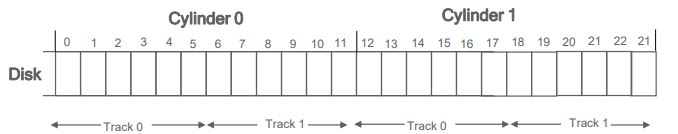
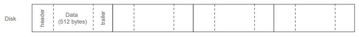

# Storage Structure

- Storage: 컴퓨터의 전원이 꺼져도 데이터를 저장할 수 있는 저장 장치

## Dist Structure

- Sector -> Track -> Cylinder
- arm이 Disk로 직접 이동해서 원하는 sector를 읽는 방식으로 데이터를 읽는다.
- Disk access time
  - sector의 데이터를 메모리로 보내는 시간
  - Position time + transfer time(메모리 이동시간, 작은 편)
- Position Time
  - Seek time + rotation time(Sector가 arm까지 오는 시간)
  - Seek time: arm을 원하는 위치에 옮기는 시간(Disk의 용량이 클수록 오래걸림)
- Disk sector or block
  - Disk sector는 일차원 배열로 표현 가능하다.
    
- Dist controller
  - CPU와 Disk가 서로 통신하게 만들어주는 회로

## Disk Scheduling

- Disk는 자신에게 접근한 request들을 request queue에 담아 처리한다. 이때 request를 처리하는 방식이 Disk Scheduling이다.

1. First Come, First Service

   - 먼저 들어온 request부터 처리하는 방식(가장 좋지 않은 방식이고, 잘 사용하지 않는다.)

2. Shortest-Seek-Time-First (SSTF)

   - 현재 cylinder의 위치에서 가장 가까운 request부터 처리하는 방식.
   - 이 방법은 starvation이 발생할 가능성이 있다.

3. SCAN

   - 한 방향으로 Disk를 읽으며 request를 처리하다가 끝에 도달했을 때 방향을 전환해 Disk 끝까지 request를 처리하는 방식

4. C-SCAN

   - SCAN과 달리 한 방향으로만 request를 처리하는 방식, 만약 Disk 끝에 도달 했다면 위치를 초기화해서 다시 Disk를 읽는다.

5. LOOK and C-LOO
   - SCAN, C-SCAN을 구현하는 방법이다.
   - 현재 요청된 request들의 cylinder번호를 고려해서 불필요한 기계적 움직임을 최소화한다.

## Disk Formatting

- Low-level formatting

  - Disk의 데이터를 저장하기전에 모든 sector에 특정 데이터로 채우는 작업
    
  - header, tailer: Disk controller가 사용하는 정보인 sector number, error-correcting code를 저장한다.
  - Partition(cylinder의 묶음) + logical formatting
    - logical formatting: 만들어진 partition에 데이터를 설정하는 작업(데이터 초기화)

- Disk Cache
  - Disk에서 읽거나 Disk에 쓴 데이터를 저장해두고 다시 사용할 수 있도록 만들어주는 역할을 한다.
  - 하드디스크까지 request가 가지 않도록해서 request처리속도를 빠르게 해준다.
  - 데이터 손실을 위해 일정 주기마다 cache에 있는 데이터를 하드디스크에 저장한다.
