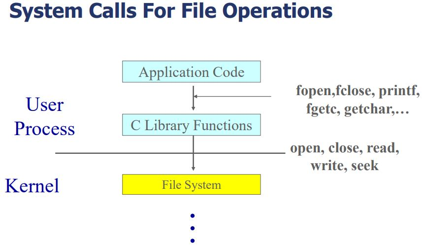
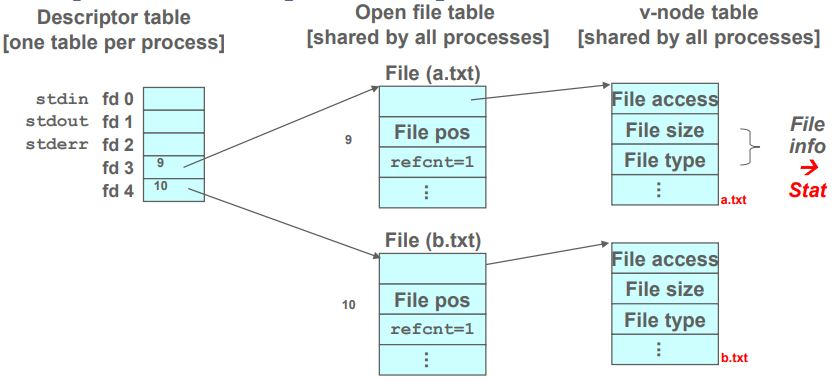

# File System

- 파일 시스템: 컴퓨터에서 파일이나 자료를 쉽게 발견 및 접근할 수 있도록 보관 또는 조직하는 시스템
- 파일 시스템은 block단위로 Disk에 데이터를 요청한다.
- Disk는 block안에 포함된 sector로 응답한다.
- block: 2n x sector
  - block은 통상 4096byte
  
  - App code에서 API를 이용해 파일 시스템에 접근

## File Descriptor & Identity (ID)

- File Identity: 파일을 구분하기 위한 파일만의 고유 ID
  - 사용자는 파일 이름으로 구분하지만 kernel에서는 ID(inode number)로 구분함
- File Descriptor: 메모리(DRAM)에 올라온 파일 엔트리의 시작 주소
  - Disk는 파일의 데이터, 정보(크기, 유형 등)를 저장하고 있다.
- File Descriptor table: File Descriptor를 관리하는 배열로, 한 프로세스당 하나를 가지고 있다.
- (Open) File table: File Descriptor와 파일 정보를 연결하는 객체, file entry로 구성되어 있다.
  
  - 파일 엔트리는 레퍼런스 카운트, 파일 오프셋등의 정보를 담고 있다.

## Open File
- 파일 open 명령입력
- 해당 파일의 데이터를 DRAM에 로드
  - v-node: 메모리 상에 존재하는 inode
- Open file table에서 빈 Entry를 찾고 v-node에 대한 정보(offset, refcnt, v-node pointer) 저장
- Descriptor table에서 빈 Entry를 찾고 방금 저장한 Open file table Entry를 포인터 하도록 함.
- 방금 저장한 Descriptor table의 Entry index를 반환
  - File Descriptor는 3번 부터 시작
  - 0: stdin, 1: stdout, 2: stderr

## File offset or position
- 파일의 위치
- 파일을 처음 읽거나 쓰면 현재 offset부터 시작함
- 파일을 읽거나 쓰면 file offset이 변경된다.
- offset이 변경되면 Open file table의 해당 파일의 offset도 변경

## Virtual File Systems

- 다양한 파일 시스템을 동시에 지원한다.
- 다른 유형의 파일 시스템을 동일한 API로 접근할 수 있다.
  - open, read, write ...
- 파일을 고유하게 표현하기 위해서 vnode구조체를 이용한다.
- vnode에서는 여러가지 파일 시스템에서 다루는 공통적인 데이터를 가지고 있다.
- 인터페이스가 구동될 때 필요한 파일시스템으로 멀티플렉싱한다.

## Directory

- Directory : 파일의 대한 정보를 저장하고 있는 node들의 집합
  - Directory는 파일을 포인터 하고 있음

- dentry pointer : Directory block을 포인터
  - directory entry: 파일에 대한 정보 저장(파일이름, i-node number) 
- Creating Directory
  - 현재 디렉토리에서 빈 Directory Entry를 찾고 디렉토리를 생성함

## Directory Implementation
- Linear list: table 형태로 구현
- 디렉토리는 디렉토리 블록으로 이루어지고 한 개 이상의 디렉토리 블록을 가지고 있다.
  - 디렉토리 블록이 꽉차있는 상태에서 새 파일을 생성하려고 하면 새로운 블록을 만들어 그 블록에 파일을 저장한다.
  - 디렉토리의 파일을 제거하려고 하면 파일을 탐색하고 디렉토리 테이블에서 파일에 대한 포인터를 제거한다. (파일의 데이터를 모두 삭제하는 것이 아님)
- 장점: 구현이 쉽다.
- 단점: 선형 탐색을 진행하기 때문에 파일이 많이 질수록 작업(파일 열기, 수정, 삭제 등) 시간이 오래 걸린다.
  - directory cache
    - 파일시스템 내 메모리에 생성된 공간, 한 번 접근(open, writen read ...)한 디렉토리를 임시로 저장한다.
    - 만약 파일에 접근하려고 한다면 먼저 캐시를 탐색하고 없다면 디렉토리 블록을 탐색한다.
    - 한 번 접근한 파일에 대해서 접근 시간이 줄어들 수 있다.

## Logical Block & Physical Block
- Logical Block
  - 파일의 데이터가 연속된 메모리에 저장되어 있다고 가정한 블록
- Physical Block
  - 파일이 실제로 저장되어있는 하드웨어 메모리 블록
- Logical Block으로 고려했을 때 파일의 데이터가 연속적으로 저장된 것으로 보이지만 실제로 저장된 Physical Block은 연속적이지 않을 수 있다.
- Logical Block & Physical Block의 매핑(mapping)
  - `Logical Block Number : Physical Block Number`에 대한 정보를 inode에 저장
  - inode는 각 파일마다 존재 함  