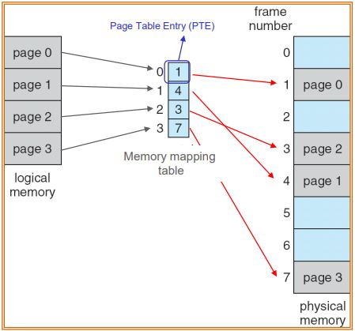
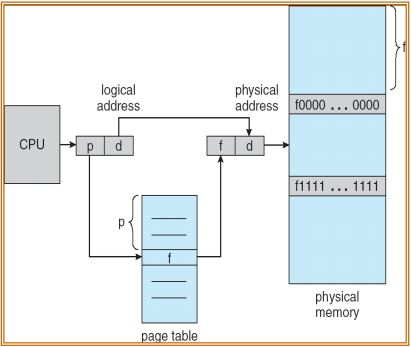
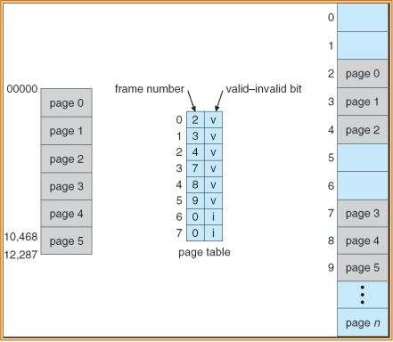
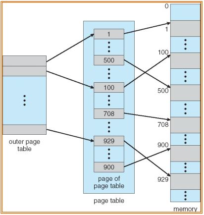
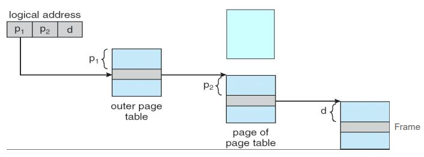

# 메모리 관리

- 메모리 관리는 멀티프로그래밍을 위해 수행한다.
- protection: 프로세스가 다른 프로세스의 메모리로 접근하지 못하도록 막는 것
  - 프로세스는 다른 프로세스의 메모리에 접근하면 안됨. 오류가 발생했을 때 다른 프로세스에 원인이 있다면 버그를 찾기 매우 힘들다.
  - 프로세스는 OS 메모리에 접근하면 안됨

  - base register: 프로세스의 시작 주소
  - limit register: 프로세스 메모리의 크기
  - 프로세스는 base register ~ base register + limit register의 범위에 해당하는 메모리에만 접근이 가능하다. 만약 범위에 벗어나는 메모리에 접근을 시도하면 프로세스는 종료된다.
  

- 프로세스가 메모리에 접근 할 때마다 CPU에서는 접근 주소를 내보낸다.
- 접근한 주소가 접근 영역에 있는지 판별한다.
  - 범위를 벗어나면 프로세스 종료(ex. segment error)

## Logical Addess, Physical Address

- Logical Addess(virtual address): CPU에서 배정되는 주소
- Virtual address space: 프로세스 virtual address의 집합
- Physical Address: DRAM상의 주소
- Physical address space: 각 virtual address에는 대응하는 Physical address가 존재한다. Virtual address space에 대응하는 모든 Physical address의 집합
- Memory Management Unit (MMU): virtual address를 Physical address로 변환하는 프로세서에 포함된 하드웨어(CPU에서 보낸 virtual address를 physical address로 변환)

- Prcess Address space와 file logical block은 비슷한 형태
- Process의 logical Address는 DRAM의 physical Address와 매칭
- 파일 시스템의 logical block, Disk의 Physical Address
## Virtual 메모리가 필요한 이유

- virtual address가 없다면 사용자 스스로가 프로그램을 특정 Physical memory에 로드해야한다.
- 다른 프로그램의 메모리를 손상시키지 않기 위해 메모리 작업을 위한 코드를 신중하게 작성해야 한다. 즉, 프로세스가 다른 프로세스가 사용중인 메모리를 침범하지 않도록 신경써야 한다.
- virtual address를 사용하면
  - 모든 애플리케이션에 주소가 0부터 무한대까지 펼쳐지는 무제한의 메모리를 제공한다고 가정하면 개발이 쉬워진다. 가상의 메모리에 저장된 데이터를 Physical memory 특정위치에 저장하면 된다.(MMU를 이용해 주소를 변환한다.)
  - OS에서는 Virtual Address를 Physical Address로 변환하는 서비스가 필요하다.
    - MMU에 포함된 relocation register의 값으로 주소 변환을 해준다.(가장 간단)
    
    - virtual address에 특정한 값을 더해 physical address로 변환하여 그 주소에 데이터를 저장하는 방법이다. 가장 단순한 구현이며, 이처럼 주소를 변환하는 기법을 Address translation이라고 한다.

## Memory Mapping and Protection

- 위에서 살펴본 Relocation방법과 limit register를 활용해 Address translation과 Protection을 동시에 구현한다.
  - 메모리 주소변환과 Protection을 동시에 수행
- 스케쥴러는 실행이 시작된 프로세스의 시작 위치(base address)와 크기(limit address)를 PCB에 저장한다.
- 먼저 CPU에서 생성된 주소가 MMU에 입력되어 limit register에 저장된 값보다 작은지 확인한다. 만약 크다면 프로세스를 종료한다.
- virtual address가 protection을 만족하는 주소라면 Relocation register에 저장된 값을 viretual address에 더해 데이터를 저장할 physical address로 변환한다. 여기까지가 MMU에서 일어나는 일이다.
- 데이터를 physical address에 저장한다.
- 실제로는 이렇게 간단하게 구현되어 있지는 않음

## Contiguous Memory Allocation

- 만약 프로세스의 메모리가 연속되지 않고 나뉘어서 할당된다면 다른 프로세스의 메모리에 침범 할 가능성이 있다. 그 문제를 해결하기 위한 기법이 Contiguous Memory Allocation, 연속적인 프로세스 메모리 할당이다.

- 하지만 이 방법은 메모리 조각화(External Fragmentation)를 발생시킬 수 있어서 남은 공간이 충분하더라도 프로세스를 메모리에 할당할 수 없다.
- 이를 해결하기 위해 Garbege collection을 사용하기도 하는데 이는 메모리의 이동이 발생하기 때문에 속도가 느려진다.
- 따라서 이 프로세스 메모리 할당방법은 사용하지 않는다.

## Solutions to External Fragmentation

- 메모리 조각화를 해결하는 방법 - Compaction(Garbage collection), Paging

### Paging
- 프로세스의 메모리를 나누어서 저장한다.

- Process를 저장하는 virtual memory를 page단위로 나누고, 같은 크기로 physical memory를 frame 단위로 나눈다.

- 이후 파일을 Disk에 저장할 때 처럼 virtual memory의 데이터를 DRAM frame에 나누어서 저장한다.
- page-frame관계를 page table에 저장한다. 프로세스의 몇번 page가 몇번 frame에 저장되어있는지를 나타내는 table이다.
  - page table은 프로세스마다 존재하게 된다. 메모리상에 존재한다.(inode는 디스크에 존재)
  
- virtual memory address와 physical memory address를 mapping할때 소프트웨어를 사용하지 않고 MMU만을 사용해 주소를 얻어낸다.

### Address Translation Architecture

- 주소는 일정한 같은 비트 수를 사용하는데 같은 비율로 비트를 쪼갠다.
- page number(p) - 현재 virtural address를 mapping시킬 physical address의 base number를 저장할 page table의 index로 사용된다.
- page offset (d) - 데이터가 저장될 page와 frame의 위치를 나타낸다.
- physical address는 p + page table[p]로 이루어 진다.

- page의 단위는 512byte~16MB크기로 하드웨어에서 결정된다. (4096byte를 가장많이 사용한다.)
  - file system의 block size는 소프트웨어적으로 결정

- 이때 page size가 2n, virtual address space의 크기가 m이라면 page offset의 비트수를 n개, 나머지 비트(m-n개)는 page number를 표현하는데 사용한다.
  
  
  - page table[page number]에 저장된 frame에 page offset 번 째에 데이터가 저장된다.

## Internal Fragmentation

- 할당된 메모리의 크기는 요청된 메모리보다 약간 클 수 있는데 사용되지 않는 공간을 Internal Fragmentation이라고 한다. 
  Example) page size : 2048 bytes, 72,766 bytes크기의 프로세스가 35개의 page + 1086 bytes만큼의 메모리가 필요하다면 , 36frame이 할당된다. 그러면 사용되지 않는 메모리의 크기는 2048 - 1086 = 962bytes가 된다.
- page의 크기가 4096일때가 가장 적합한 크기다.

## Memory Protection

- 운영체제 및 기타 프로세스의 코드 및 데이터에 대한 불법 액세스를 방지해야 한다.
- 해결책: 각 page마다 protection bit 설정하기
  - protection bit는 page entry마다 설정한다.
  - 하나의 비트가 page의 read-write, read-only를 나타낸다.
    - 0: 수정불가
    - 1: write 가능
  - 메모리의 접근하면 MMU가 protection bit를 확인한다.
    - 만약 bit가 0인 메모리에 write를 시도하면 프로세스에게 OS가 종료 signal을 보낸다.

## Valid-Invalid Bit

- 프로세스의 가상 주소 공간의 일부만 physical memory에 매핑될 수 있다. 일부 페이지는 연결된 프레임에 매핑되지 않을 수 있다. 페이지가 프레임에 매핑되어 있지 않은지 여부를 표시하여 적절한 작업을 수행해야 한다.

- virtual memry가 physical memory보다 클 경우 매핑되지 않을 수 있다.
- 매핑 여부를 표시하기 위해 valid-invalid bit를 사용한다.
  - valid-invalid bit는 page entry마다 추가한다.
    - valid: 해당 page는 frame에 매핑되어있다.
    - invalid: 해당 page는 frame에 매핑되어있지 않다.
- 메모리에 접근하려고 하면 bit를 확인한다.
  - 만약 invalid bit인 page에 접근하면 Exception이 발생하고 프로세스가 종료된다.
    

## Shared Pages

- 보통 문자코드는 읽기 전용이다. 즉, 실행 중에는 변경되지 않는다. 따라서 물리적 메모리 공간을 불필요하게 낭비하지 않기위해 프로세스들은 복사된 코드를 공유하도록한다. 단, 프로세스마다 가지고 있는 data는 서로 공유하면 안된다.
  

## Hierarchical Page Table

- 대부분의 컴퓨터 시스템은 큰 logical address space를 지원한다. (232 ~ 264) page table의 크기가 과도하게 커진다.
- 해결책은 페이지 테이블을 비연속적으로 할당하는 것이다. page table을 page unit단위로 쪼개서 관리한다.
  
- outer page table의 각 page table entry에는 page에 대한 매핑정보와 page table의 할당된 frame이 포함된다.
- logical address는 32bit의 크기인데 그중 10bit는 outer page number, 10bit는 page of page table number, 나머지는 page offset을 담고 있다.
  

## Segment
