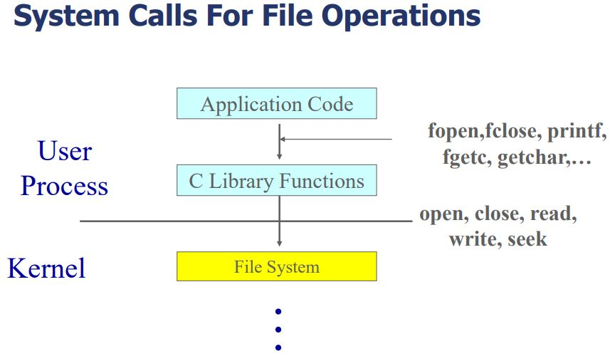

# File System

- 파일 시스템: 컴퓨터에서 파일이나 자료를 쉽게 발견 및 접근할 수 있도록 보관 또는 조직하는 체제
- 파일 시스템은 block단위로 Disk에 데이터를 요청한다.
- block: 2n x sector
  
  - App code에서 API를 이용해 파일 시스템에 접근

## File Descriptor & Identity (ID)

- File Identity: 파일을 구분하기 위한 파일만의 고유 ID
- File Descriptor: 메모리에 올라온 파일 엔트리의 시작 주소
- File Descriptor table: File Descriptor를 관리하는 배열로 한 프로세스당 가지고 있다.
- (Open) File table: File Descriptor와 파일 정보를 연결하는 객체, file entry로 구성되어 있다.
  
  - 파일 엔트리는 레퍼런스 카운트, 파일 오프셋등의 정보를 담고 있다.

## Virtual File Systems

- 여러 파일 시스템을 동시에 지원한다.
- 다른 유형의 파일 시스템을 동일한 API로 접근할 수 있다.
- 파일을 고유하게 표현하기 위해서 vnode구조체를 이용한다.
- vnode에서는 여러가지 파일 시스템에서 다루는 공통적인 데이터를 가지고 있다.
