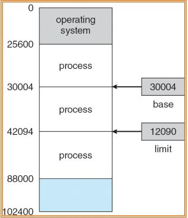
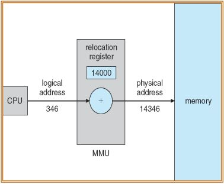

# 메모리 관리

- 메모리 관리는 멀티프로그래밍을 위해 수행한다.
- protection: 프로세스가 다른 프로세스의 메모리로 접근하지 못하도록 막는 것
- base register: 프로세스의 시작 주소
- limit register: 프로세스 메모리의 크기
- 프로세스는 base register ~ base register + limit register의 범위에 해당하는 메모리에만 접근이 가능하다. 만약 범위에 벗어나는 메모리에 접근을 시도하면 프로세스는 종료된다.
  

## Logical Addess, Physical Address

- Logical Addess(virtual address): CPU에서 배정되는 주소
- Virtual address space: 프로세스 virtual address의 집합
- Physical Address: DRAM상의 주소
- Physical address space: 각 virtual address에는 대응하는 Physical address가 존재한다. Virtual address space에 대응하는 모든 Physical address의 집합
- Memory Management Unit (MMU): virtual address를 Physical address로 변환하는 프로세서에 포함된 하드웨어(CPU에서 보낸 virtual address를 physical address로 변환)

## Virtual 메모리가 필요한 이유

- 사용자 스스로가 프로그램을 특정 Physical memory에 로드해야한다.
- 다른 프로그램의 메모리를 손상시키지 않기 위해 메모리 작업을 위한 코드를 신중하게 작성해야 한다.
- virtual address를 사용하면
  - 주소가 0부터 무한대까지 펼쳐지는 무제한의 메모리를 제공한다고 가정하면 개발이 쉬워진다. 가상의 메모리에 저장된 데이터를 Physical memory 특정위치에 저장하면 된다.(MMU를 이용해 주소를 변환한다.)
    
    - virtual address에 특정한 값을 더해 physical address로 변환하여 그 주소에 데이터를 저장하는 방법이다. 가장 단순한 구현이며, 이처럼 주소를 변환하는 기법을 Address translation이라고 한다.

## Memory Mapping and Protection

- 위에서 살펴본 Relocation방법과 limit register를 활용해 Address translation과 Protection을 동시에 구현한다.
- 먼저 CPU에서 생성된 주소가 MMU에 입력되어 limit register에 저장된 값보다 작은지 확인한다. 만약 크다면 프로세스를 종료한다.
- virtual address가 protection을 만족하는 주소라면 Relocation register에 저장된 값을 더해 데이터를 저장할 physical address로 변환한다. 여기까지가 MMU에서 일어나는 일이다.
- 데이터를 physical address에 저장한다.

## Contiguous Memory Allocation

- 만약 프로세스의 메모리가 연속되지 않고 나뉘어서 할당된다면 다른 프로세스의 메모리에 침범 할 가능성이 있다. 그 문제를 해결하기 위한 기법이 Contiguous Memory Allocation, 연속적인 프로세스 메모리 할당이다.
