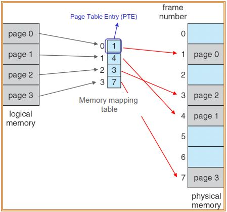
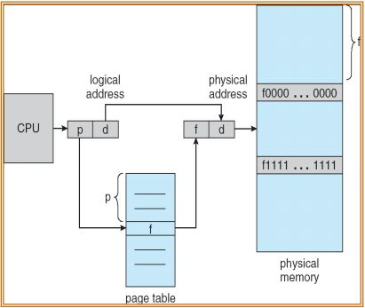

# 메모리 관리

- 메모리 관리는 멀티프로그래밍을 위해 수행한다.
- protection: 프로세스가 다른 프로세스의 메모리로 접근하지 못하도록 막는 것
- base register: 프로세스의 시작 주소
- limit register: 프로세스 메모리의 크기
- 프로세스는 base register ~ base register + limit register의 범위에 해당하는 메모리에만 접근이 가능하다. 만약 범위에 벗어나는 메모리에 접근을 시도하면 프로세스는 종료된다.
  

## Logical Addess, Physical Address

- Logical Addess(virtual address): CPU에서 배정되는 주소
- Virtual address space: 프로세스 virtual address의 집합
- Physical Address: DRAM상의 주소
- Physical address space: 각 virtual address에는 대응하는 Physical address가 존재한다. Virtual address space에 대응하는 모든 Physical address의 집합
- Memory Management Unit (MMU): virtual address를 Physical address로 변환하는 프로세서에 포함된 하드웨어(CPU에서 보낸 virtual address를 physical address로 변환)

## Virtual 메모리가 필요한 이유

- 사용자 스스로가 프로그램을 특정 Physical memory에 로드해야한다.
- 다른 프로그램의 메모리를 손상시키지 않기 위해 메모리 작업을 위한 코드를 신중하게 작성해야 한다.
- virtual address를 사용하면
  - 주소가 0부터 무한대까지 펼쳐지는 무제한의 메모리를 제공한다고 가정하면 개발이 쉬워진다. 가상의 메모리에 저장된 데이터를 Physical memory 특정위치에 저장하면 된다.(MMU를 이용해 주소를 변환한다.)
    
    - virtual address에 특정한 값을 더해 physical address로 변환하여 그 주소에 데이터를 저장하는 방법이다. 가장 단순한 구현이며, 이처럼 주소를 변환하는 기법을 Address translation이라고 한다.

## Memory Mapping and Protection

- 위에서 살펴본 Relocation방법과 limit register를 활용해 Address translation과 Protection을 동시에 구현한다.
- 먼저 CPU에서 생성된 주소가 MMU에 입력되어 limit register에 저장된 값보다 작은지 확인한다. 만약 크다면 프로세스를 종료한다.
- virtual address가 protection을 만족하는 주소라면 Relocation register에 저장된 값을 더해 데이터를 저장할 physical address로 변환한다. 여기까지가 MMU에서 일어나는 일이다.
- 데이터를 physical address에 저장한다.

## Contiguous Memory Allocation

- 만약 프로세스의 메모리가 연속되지 않고 나뉘어서 할당된다면 다른 프로세스의 메모리에 침범 할 가능성이 있다. 그 문제를 해결하기 위한 기법이 Contiguous Memory Allocation, 연속적인 프로세스 메모리 할당이다.

- 하지만 이 방법은 메모리 조각화를 발생시킬 수 있어서 남은 공간이 충분하더라도 프로세스를 메모리에 할당할 수 없다.(External Fragmentation)
- 이를 해결하기 위해 Garbege collection을 사용하기도 하는데 이는 메모리의 이동이 발생하기 때문에 속도가 느려진다.
- 따라서 이 프로세스 메모리 할당방법은 사용하지 않는다.

## Solutions to External Fragmentation

- 메모리 조각화를 해결하는 방법

### Paging

- Process를 저장하는 virtual memory를 page단위로 나누고, 같은 크기로 physical memory를 frame으로 나눈다.

- 이후 파일을 Disk에 저장할 때 처럼 virtual memory의 데이터를 DRAM frame에 나누어서 저장한다.
- page-frame관계를 page table에 저장한다. 프로세스의 몇번 page가 몇번 frame에 저장되어있는지를 나타내는 table이다.
  
- virtual memory address와 physical memory address를 mapping할때 소프트웨어를 사용하지 않고 MMU만을 사용해 주소를 얻어낸다.

### Address Translation Architecture

- 주소는 일정한 같은 비트 수를 사용하는데 같은 비율로 비트를 쪼갠다.
- page number(p) - 현재 virtural address를 mapping시킬 physical address의 base number를 저장할 page table의 index로 사용된다.
- page offset (d) - 데이터가 저장될 page와 fram의 위치를 나타낸다.
- page의 단위는 512byte~16MB크기로 하드웨어에서 결정된다.

- 이때 page size가 2n, virtual address의 비트수가 m이라면 page offset의 비트수를 n, 나머지 비트는 page number를 표현하는데 사용한다.
  
  
