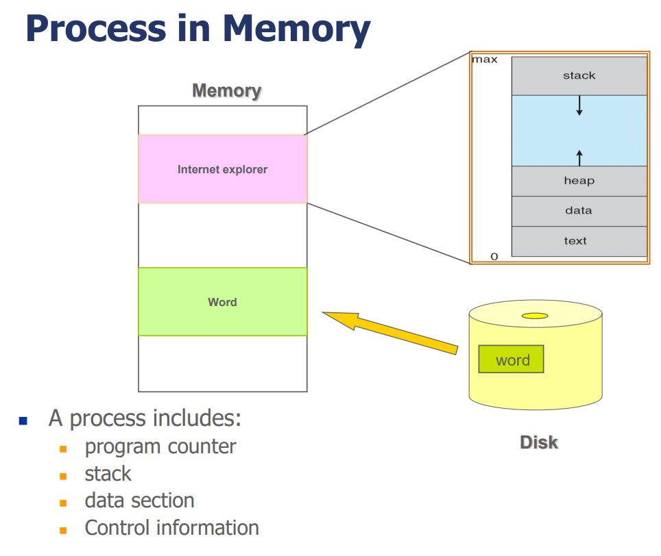
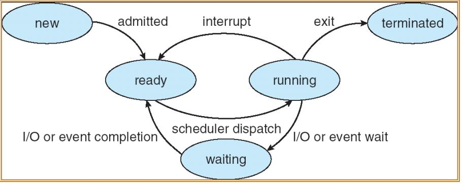
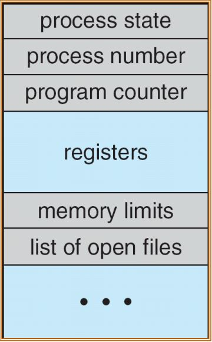

# Process

## Process Concept

- 프로세스는 실행중인 프로그램(.exe)이다.

  - 프로세스는 자신만의 자원, 메모리 공간, 제어 정보, Program count를 가진다.
  - process in memry
    

### Process State

- new : 프로세스가 완전히 만들어지기 전 단계
- ready : 실행되기 전에 CPU에 올라온 프로세스
  - 프로세스가 CPU상으로 옮겨지면 바로실행.
- running : 실행 중인 프로세스
  - 지정된 시간동안 CPU를 점유한 프로세스는 ready상태로 넘어감.
- waiting : CPU밖에서 ready상태로 전환되기를 기다리는 프로세스
  - I/O event, 특정 event가 발생하면 waiting상태로 전환된다.
  - ready상태를 거쳐서 running상태로 가야한다. 다시 ready로 넘어갈 때는 가장 뒤 순서로 이동.
  - 프로세스가 CPU상으로 옮겨져도 실행되지 않음.
- terminated : 프로세스 종료

  - 종료된 프로세스의 리소스를 처리해줘야 한다. 그렇지 않으면 zombie상태의 프로세스가 되어버린다.

### Process Control Block

- 프로세스의 정보를 담고 있는 구조체.

  - Process State
  - Program counter
  - CPU scheduling informaion
  - Memory management information
  - Accounting information
  - I/O status information

    

### Process Scheduling

- 다음으로 실행될 프로세스를 결정한다.
- 멀티프로그래밍, Time-shareing을 지원한다.
- CPU Switch Process from to Process
- Process Scheduling Queue
  - Job Queue : 모든 프로세스를 관리하는 큐
  - Ready Queue : ready상태에 놓여 있는 프로세스를 관리하는 큐
  - Device Queue : device I/O로 인해 waiting상태인 프로세스를 관리하는 큐
  - Waiting Queue : 리소스(메시지 큐, 소켓, 세마포어 등)를 사용하느라 waiting상태에 놓인 프로세스를 관리하는 큐
- Process Scheduler
  - 어떤 프로세스를 CPU에서 실행될지 결정
- Context Switch

  - CPU 레지스터에 저장된 PCB를 다른 PCB로 교체하는 작업 = 실행중인 프로세스를 다른 프로세스로 바꾼다.

### Process Creation

- 프로세스는 생성될때 고유한 ID를 갖는다.
- 자식 프로세스를 생성 할 경우 부모 프로세스의 리소스는 자식으로 모두 복사된다.
- 모두 복사할 때 리소스의 용량이 많을 경우 CPU에 부하가 걸릴 수 있으므로 공유 메모리를 사용하여 위험을 방지 할 수 있다.
- 자식 프로세스가 부모 프로세스에서 변경한 데이터에 접근 할 수 없다.
- 변경한 데이터는 부모, 자식 자신들만의 메모리에 기록해야 한다.

- IPC
  - 메시지 시스템
  - 공유 메모리
