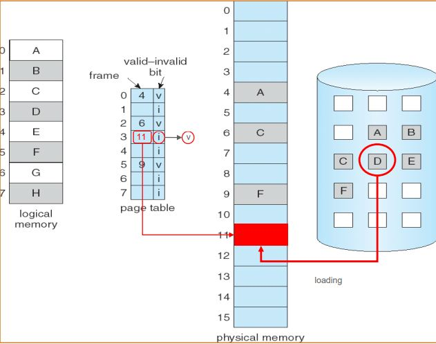
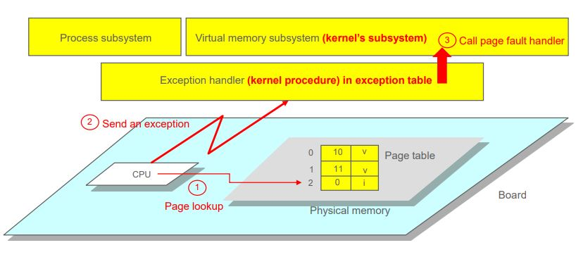
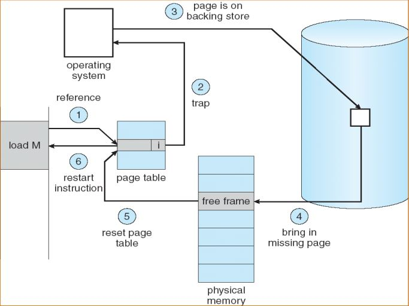
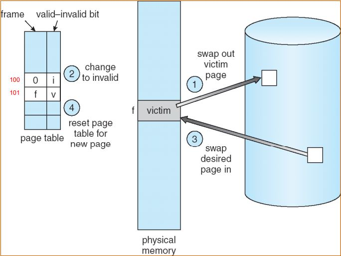
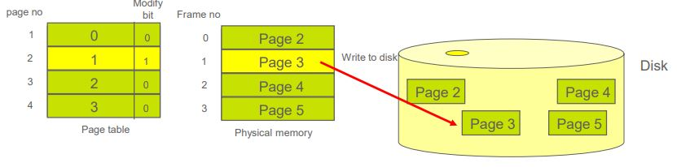
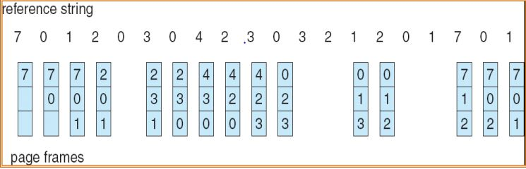
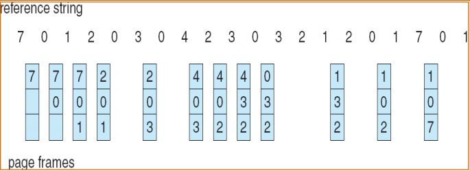
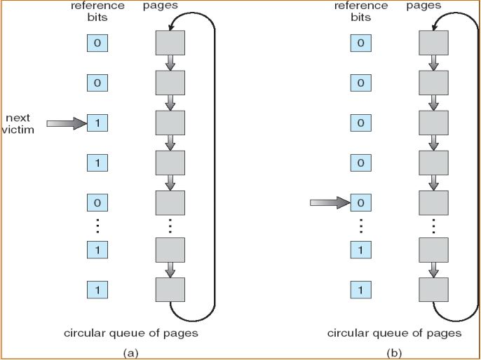

## 메모리 사용 패턴

- General use pattern

  - 프로그램의 일부만 실행되며 전체 프로그램은 실행되지 않는다. 프로그램의 많은 부분이 실행에 거의 사용되지 않는다.
  - 메모리에 부분적으로만 있는 프로그램의 예
    - 에러, 예외처리 코드
    - 100개의 요소를 담을 수 있는 배열을 10개만 사용하는 경우

- 실행 중 프로그램의 많은 부분이 필요하지 않은 상태에서 전체 프로그램을 메모리에 로드하면 매우 비효율적이다.

## Demand Paing

- 프로그램 전체를 메모리에 로드 할 필요가 없다.
- 프로그램에서 실행 중인 일부분만 메모리에 로드한다.
- 실행되지 않는 부분은 메모리로 절대 로드되지 않는다.

- 장점

  - 프로그램은 더 이상 사용 가능한 Pysical 메모리 양에 의해 제한되지 않는다.
  - 더 많은 프로그램을 같은 시간에 실행 시킬 수 있다.
  - 프로그램을 메모리로 로드하거나 교환하는 데 필요한 I/O가 적기 때문에 프로그램이 빠르게 실행될 수 있다.

- Demand paging의 절차
  1. 저장소(Disk)의 페이지는 Pysical 메모리(DRAM) 여유 공간으로 로드된다.
  2. 해당 페이지의 페이지 테이블 항목은 실제 프레임으로 설정된다. 즉, 페이지와 프레임 간의 매핑이 설정된다.
  3. Page Table Entry의 Valid-invalid bit가 "valid"로 설정된다.
     

## Page Fault

- 프로세스가 메모리에 로드되지 않은 페이지에 접근을 시도하거나, Valid-invalid bit가 "invalid"로 설정된 페이지에 접근을 시도하는 것을 두고 Page Fault라 한다.

- Page fault exception
  - MMU는 잘못된 비트가 설정되어 커널에 예외가 발생했음을 알린다. 이 예외는 커널이 원하는 페이지를 메모리에 가져오지 못한 결과다.
  - 예외에서 커널은 실행 중인 프로세스의 실행을 중지하고 예외 핸들러를 수행한다. 핸들러를 실행하기 전에 프로세스의 컨텍스트를 PCB에 저장해야 한다.
  - Page fault 핸들러에서 돌아오면 중단된 프로세스가 page fault 후 정확히 동일한 명령을 수행한다.
    

## Steps in Handling a Page Fault

1. Page access
2. page fault 발생, page가 저장소에 없는 경우(프로세스 종료)
3. page가 저장소에 있는 경우 Disk로 접근
4. 접근 할 page를 physical 메모리로 로드
5. page table 업데이트(invalid => valid, set frame number)
6. 프로세스 재시작

## Page Replacement

- 프로세스가 실행 중일 때 page fault가 발생한다. 커널은 디스크에서 원하는 page가 어디에 위치하는지 알아냈지만 메모리(DRAM)에 로드 할 공간이 없는 경우에 해결 할 수 있는 방법이 몇 가지 있다.

1. process termination

- 커널은 page fault가 발생한 프로세스를 종료시킨다.

2. process swapping

- 커널은 ready queue or waiting queue에 있는 precess를 swap하여 모든 프레임을 해제한다.

3. Page Replacement

   - frame에 여유공간이 없을 경우, 커널은 현재 사용되지 않는 page를 찾아 해제한다.

   - 해제하는 동안, 커널은 해제되는 page를 Disk에 기록한다.(page out)
   - 커널은 페이지가 더 이상 메모리에 없음을 나타내기 위해 대체된 페이지로 프로세스의 페이지 테이블을 변경한다.
     

## Page Replacement: Modify (Dirty) Bit

- 사용 가능한 프레임이 없는 경우, 두 페이지 전송이 필요하다.(out and in) 이 상황은 사실상 page fault sevice 시간을 두배로 증가시킨다.
- 해결책으로는 modify bit를 사용한다.
  - 각 page table entry마다 페이지와 연관된 modify bit가 있다.
  - page가 수정될 때마다 page의 modify bit는 하드웨어(MMU)에 의해 결정된다.
  - 교체로 인해 페이지를 교체할 때 커널은 modify bit가 설정되어 있는지 확인한다. 이 경우 수정된 내용이 손실되지 않도록 페이지를 디스크에 기록해야한다.(modify bit == 1)  그렇지 않은 경우 페이지는 삭제되고 새 페이지로 덮어쓰기만 하면된다.(modify bit == 0)

## Page Replacement Algorithm

- page 교체가 필요할 때, 교체 할 page를 고르는 알고리즘이다.
- page fault 비율은 Page Replacement Algorithm에 따라 달라진다. page fault가 적은 알고리즘을 선택해야 한다.

- Reference string
  - 페이지 참조의 시퀀스, 참조할 페이지 번호가 나열된다. 
    ex) 1, 2, 3, 4, 1, 2
  - 이 문자열에서 page fault 수를 계산하여 페이지 교체 알고리즘을 평가하는 데 사용된다.

### FIFO Page Replacement

- 가장 오래동안 메모리에 머물러 있던 page를 교체 할 page로 선택하는 알고리즘
- 가장 먼저 memory에 로드된 page를 선택하여 교체한다.

### Optimal Page Replacement

- 가장 오래동안 사용되지 않을 page를 교체 할 page로 선택한다.
- 하지만 미래에 접근될 page를 판단할 수 없다. 실제로 사용될 수 없는 알고리즘.

### LRU Page Replacement

- Optimal Page Replacement의 근사한 알고리즘이다.
- 커널은 최근 과거를 가까운 미래의 reference string의 근사치로 사용한다. (과거를 통해 미래를 예측)
- 가장 먼 과거에 접근했던 page를 가장 오래동안 사용되지 않을 page로 간주하여 교체 할 page로 선택한다.

### LRU-Approximation Page Replacement

- 완벽한 LRU 페이지 교체를 위한 충분한 하드웨어 지원을 제공하는 컴퓨터 시스템은 거의 없다. 비슷하게 구현을 할 수 있다.
- reference bit
  - 많은 시스템이 reference bit를 제공한다.
  - page에 대한 reference bit는 page가 참조될 때마다 하드웨어에 의해 설정된다.
- 기본 작업
  - 모든 reference bit는 커널에 의해 0으로 초기화된다.
  - 참조된 각 페이지와 관련된 reference bit는 하드웨어에 의해 설정된다.
  - 어느 정도 시간이 지나면 커널은 reference bit를 조사함으로써 어떤 페이지가 사용되었고 어떤 페이지가 사용되지 않았는지 알 수 있다.

### Second-Chance Algorithm

- 기본 알고리즘
  - 처음에는 모든 페이지가 circular queue에서 관리되는 것으로 가정한다.
  - 커널은 주기적으로 루틴을 호출하여 페이지의 reference bit를 검사한다.
  - 값이 0이면 커널이 해당 page를 교체한다.
  - 값이 1이면 0으로 변경하여 한 번의 기회가 더 주어진다.
  - 커널이 circular queue의 다음 페이지를 선택하기 위해 이동한다.

### Thrasing
- 짧은 시간동안 page fault가 많이 발생하는 현상
- 원인: 메모리 크기가 많은 프로세스를 실행시키기에는 작음
- page fault가 발생하면 Disk I/O가 발생하므로 CPU의 성능이 저하된다.