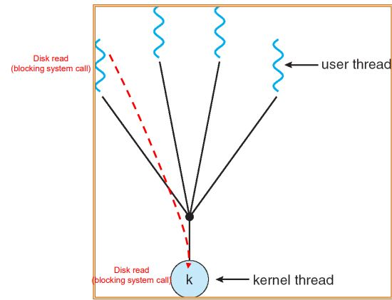
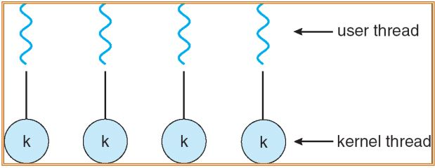
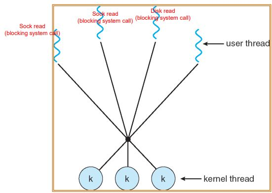

# Multithreaded Programming

## Motivation

- 프로세스의 문제점
  - context switching overhead가 크다.
  - 프로세스 생성시간이 길다.
  - 동기화 overhead가 크다.

## Multithreading

- 프로세스는 여러개의 thread로 구성된다.
  - Thread는 CPU의 기본 실행단위이다.
  - Thread context는 thread ID, program counter, register set, stack을 포함하고 있다.
  - 현재 운영체제에는 멀티스레딩 프로그래밍을 지원한다.

## Procedure Calls Vs Multithreading

- 비슷한점
  - 다른 영역에 선언된 변수들에
    접근 할 수 없다.
  - 전역변수, heap공간에 모두 접근 할 수 있다.
- 다른점
  - 스레드는 자신만의 스택을 가지고 있다.
  - 함수는 절차적으로 실행되고, 스레드는 병렬적으로 실행된다.

## Benefits

- 작은 context switching overhead
- 작은 생성 시간
- 작은 동기화 overhead
- 작은 메모리 소요량

## Relationship between Process and Thread

- 프로세스는 여러개의 스레드와 리소스 모음으로 이루어져 있다.
- 프로세스는 스레드의 실행 환경이다.

## Thread Library

- User-level library: kernel의 도움, system call없이 user space에서 thread를 생성하고 관리한다.
- Kernel-level library: kernel, system call을 사용해서 Kernel이 thread를 생성하고 관리한다.

## Multithreading Models

1. Many-to-One

- 하나의 kernel thread가 여려개의 user-level thread를 관리하는 모델
  - 단점: 만약 한 thread가 block system call(I/O, sleep etc.)을 한다면 나머지 thread들은 동작을 멈추게 된다.
    

2. One-to-One

- user-level thread와 kernel thread가 각각 하나씩 연결되어 있는 모델
  - 이점: 어떤 thread가 block system call을 하더라도 다른 thread에 영향을 미치지 않는다.
  - 단점: thread가 많아지면 많아질수록 OS에는 부담이 증가한다.
    

3. Many-to-Many

- user-level thread를 더 적은 개수의 kernel thread로 연결한 모델
  - 이점: 제한된 수의 kernel thread를 사용하는 모델, 좋은 동시성을 제공한다.
  - 단점: 만약 kernel thread와 연결된 thread들 모두 block system call을 하게되면 다른 thread가 실행되지 않을 수 있다.
    

## Thread Cancellation

- thread의 실행이 완료되기 전에 스레드를 종료하는 작업
  1. Asynchronous cancellation: thread의 종료요청이 들어오는 즉시 thread를 종료한다.
  2. Deferred cancellation: thread가 바로종료되지 않고, 종료되어도 괜찮을 때 까지 기다린다.
     - thread를 동기화하고 lock상태에서 종료하게 되면 lock이 걸린 다른 thread의 실행이 멈추게 될 수 있다.(resource leak)
- thread 종료는 대상 thread가 안전하게 종료될 수 있는 지점에서만 발생하도록 해야한다.
